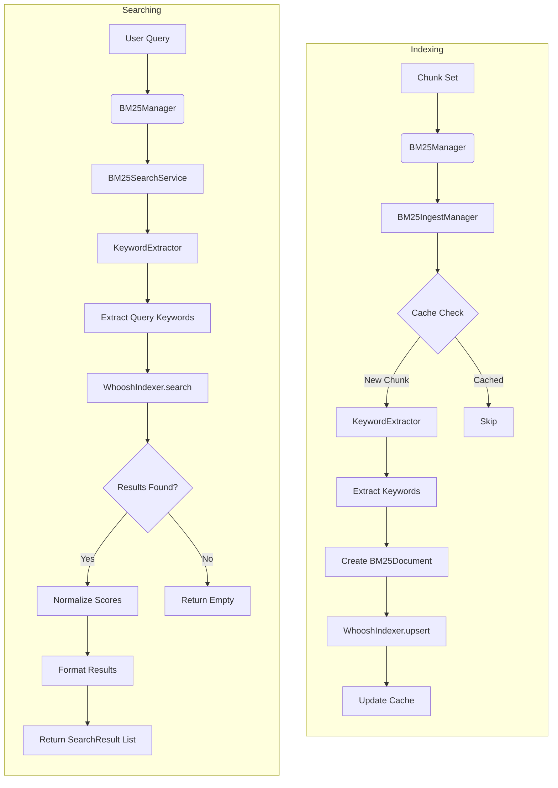

# BM25 Module — Keyword-based Search and Indexing

Version: Detailed BM25 module for RAG (Retrieval-Augmented Generation) system.

**Short description**: The `BM25/` directory contains components implementing the BM25 algorithm for keyword-based search, including indexing with Whoosh, keyword extraction with spaCy, and a search service. This module provides an alternative retrieval method alongside vector similarity search.

## ✨ Key Features

- 🔍 **Keyword-based Retrieval**: BM25 algorithm for traditional information retrieval.
- 🌐 **Multi-language Support**: Keyword extraction for English. Vietnamese support is a placeholder and currently defaults to the English model.
- 🏗️ **Whoosh Integration**: Efficient indexing and search backend.
- 🔄 **Hybrid Search**: Complements semantic vector search for robust retrieval.
- 📊 **Scoring Algorithm**: BM25F scoring with multi-field support.

## 🚀 Quick Start

### Install Dependencies

```bash
# Install core dependencies from the root directory
pip install -r requirements.txt

# Install the default spaCy model for keyword extraction
python -c "import spacy; spacy.cli.download('en_core_web_sm')"
```

## 🏗️ Architecture

The BM25 module is coordinated by the `BM25Manager`, which provides a simple interface for indexing and searching. It gracefully handles missing dependencies (`whoosh`, `spacy`) so the main application can run without them.

### Directory Contents

- `bm25_manager.py` — Main coordinator and public-facing facade for all BM25 operations.
- `ingest_manager.py` — Coordinates chunk ingestion into the BM25 index.
- `whoosh_indexer.py` — Whoosh backend for indexing and searching.
- `search_service.py` — High-level search service with score normalization.
- `keyword_extractor.py` — Keyword extraction using spaCy.

### Data Flow

A typical data flow for indexing and searching looks like this:

**Indexing:**
`PDF Chunks → BM25Manager.ingest_chunk_set() → BM25IngestManager → KeywordExtractor → WhooshIndexer → BM25 Index`

**Searching:**
`User Query → BM25Manager.search() → BM25SearchService → KeywordExtractor → WhooshIndexer → Search Results`



## 💡 Usage Example

The `BM25Manager` is the recommended entry point for all BM25 operations. It simplifies initialization and ensures that dependencies are handled correctly.

```python
from pathlib import Path
from BM25.bm25_manager import BM25Manager
# Assume 'chunk_set' is a valid ChunkSet object from the chunking process
# from chunkers.model.chunk_set import ChunkSet 

# 1. Initialize the manager
# These paths should point to your desired output and cache directories
output_dir = Path("./output")
cache_dir = Path("./cache")
bm25_manager = BM25Manager(output_dir=output_dir, cache_dir=cache_dir)

# 2. Check if the BM25 components are available
if bm25_manager.is_available():
    # 3. Index a set of chunks
    # This would typically be called from your document processing pipeline
    try:
        indexed_count = bm25_manager.ingest_chunk_set(chunk_set)
        print(f"Successfully indexed {indexed_count} new chunks.")
    except Exception as e:
        print(f"An error occurred during BM25 indexing: {e}")

    # 4. Perform a search
    query = "machine learning algorithms"
    try:
        results = bm25_manager.search(query, top_k=5)
        print(f"Found {len(results)} results for '{query}':")
        for result in results:
            score = result.get('bm25_normalized_score', result.get('bm25_raw_score'))
            print(f"  - Doc ID: {result.get('chunk_id')}, Score: {score:.4f}")
            print(f"    Text: {result.get('text', '')[:100]}...")
    except Exception as e:
        print(f"An error occurred during BM25 search: {e}")
else:
    print("BM25 components are not available. Skipping BM25 operations.")

```

## 🔌 API Contract

### Inputs
- **`BM25Manager.ingest_chunk_set()`**: Takes a `ChunkSet` object containing the chunks to be indexed.
- **`BM25Manager.search()`**: Takes a `query` (str), with optional `top_k` (int) and `normalize_scores` (bool) arguments.

### Outputs
- **`BM25Manager.ingest_chunk_set()`**: Returns the number of chunks successfully indexed (`int`).
- **`BM25Manager.search()`**: Returns a `List[Dict]` where each dictionary represents a search result. Key fields include:
  - `chunk_id: str`
  - `bm25_raw_score: float`
  - `bm25_normalized_score: float`
  - `text: str`
  - `metadata: dict`

### Error Handling
- The `BM25Manager` is designed to fail gracefully. If `whoosh` or `spacy` are not installed, `is_available()` will return `False`, and ingest/search calls will return empty results instead of raising exceptions.

## ⚠️ Operational Notes

- **Missing spaCy model**: If the `en_core_web_sm` model is not downloaded, the system will fail on first use. Run the command in the Quick Start section to install it.
- **Whoosh Index Corruption**: If the index becomes corrupt, you may need to delete the contents of the `bm25_index` directory and re-index your documents.
- **Small Result Sets**: Z-score normalization is automatically skipped for small result sets to avoid skewed scores.

## 🤝 Contributing

- Write comments and docstrings in Vietnamese.
- Handle spaCy import errors gracefully.
- Use protocol interfaces for testability.
- Add proper error handling for Whoosh operations.

## 🧪 Testing Guidelines

- Mock spaCy models for unit tests.
- Test with small Whoosh indexes.
- Verify keyword extraction accuracy.
- Test cache behavior with duplicate chunks.
