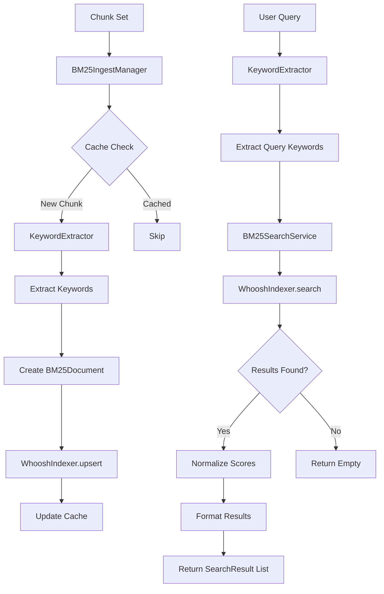

# Module BM25 — Keyword-based Search và Indexing

Phiên bản: chi tiết module BM25 cho hệ thống RAG (Retrieval-Augmented Generation).

Mô tả ngắn: thư mục `BM25/` chứa các thành phần triển khai BM25 algorithm cho keyword-based search, bao gồm indexing với Whoosh, keyword extraction với spaCy, và search service. Module này cung cấp alternative retrieval method song song với vector similarity search.

## Mục tiêu và phạm vi

- Tách trách nhiệm: triển khai BM25 search độc lập với vector search
- Cung cấp keyword-based retrieval làm bổ sung cho semantic search
- Hỗ trợ multi-language keyword extraction (English, Vietnamese)
- Tích hợp với pipeline RAG chính

## Kiến trúc tổng quan

Thư mục `BM25/` gồm các phần chính:

- `ingest_manager.py` — Điều phối ingest chunks vào BM25 index
- `whoosh_indexer.py` — Whoosh backend cho indexing và search
- `search_service.py` — High-level search service với scoring
- `keyword_extractor.py` — Trích xuất keywords bằng spaCy
- `__init__.py` — Module initialization

Luồng dữ liệu điển hình:

```text
PDF Chunks → BM25IngestManager → KeywordExtractor → WhooshIndexer → BM25 Index
User Query → KeywordExtractor → BM25SearchService → WhooshIndexer → Results
```

## Các module chính (chi tiết)

### ingest_manager.py

- Mục đích: điều phối việc ingest chunks vào BM25 index
- Tính năng:
  - Convert chunks thành BM25Document format
  - Quản lý cache để tránh duplicate indexing
  - Batch processing cho hiệu suất
  - Error handling và logging

### whoosh_indexer.py

- Mục đích: Whoosh backend cho BM25 indexing và search
- Tính năng:
  - Schema definition cho BM25 fields
  - Upsert/delete documents
  - BM25F scoring algorithm
  - Multi-field search (content + keywords)

### search_service.py

- Mục đích: high-level search service với score normalization
- Tính năng:
  - Query preprocessing với keyword extraction
  - Score normalization (z-score)
  - Result formatting
  - Safeguards cho small result sets

### keyword_extractor.py

- Mục đích: trích xuất keywords từ text bằng spaCy
- Tính năng:
  - Multi-language support (English, Vietnamese)
  - Lemma extraction và noun phrases
  - Language detection heuristics
  - Lazy loading spaCy models

## Hành vi "Auto-quét" (Auto-scan) và tích hợp với pipeline

Module `BM25/` tích hợp với pipeline RAG chính:

- **Automatic Ingest**: Pipeline tự động gọi BM25IngestManager khi process PDFs
- **Dual Retrieval**: Cả vector search và BM25 search có thể chạy song song
- **Fallback Option**: BM25 hoạt động ngay cả khi vector search fail
- **Cache Management**: Sử dụng chung cache system với pipeline

Ví dụ sử dụng trong pipeline:

```python
# Trong RAGPipeline.process_pdf()
bm25_indexed = self._ingest_bm25_chunk_set(chunk_set)

# Search với cả hai methods
vector_results = self.search_similar(faiss_file, metadata_file, query, top_k=5)
bm25_results = self.search_bm25(query, top_k=5)
```

## Contract (tóm tắt API / dữ liệu)

- Input cho `BM25IngestManager.ingest_chunk_set()`: ChunkSet object
- Output: số chunks đã index thành công (int)
- Input cho `BM25SearchService.search()`: query string, top_k, normalize_scores
- Output: List[SearchResult] với raw_score và normalized_score

## Edge cases và cách xử lý

- spaCy model missing: fallback to basic tokenization
- Whoosh index corruption: recreate index
- Small result sets: skip z-score normalization
- Memory constraints: batch processing cho large datasets

## Logging & Debugging

- Chi tiết logging cho ingest operations
- Debug info cho search queries và scoring
- Performance metrics cho indexing speed

## Kiểm thử

```powershell
# Test BM25 components
python -m pytest test/bm25/ -v
```

## Hướng dẫn đóng góp (contributors)

- Viết comment và docstring bằng tiếng Việt
- Handle spaCy import errors gracefully
- Use protocol interfaces cho testability
- Add proper error handling cho Whoosh operations

## Tài liệu tham chiếu và liên kết

- Pipeline: `pipeline/rag_pipeline.py` — main integration point
- Loaders: `loaders/model/` — chunk data structures
- Config: `config/app.yaml` — BM25 settings

## Ghi chú triển khai / Assumptions

- Whoosh library required (thêm vào requirements.txt)
- spaCy models available (en_core_web_sm, vi_core_news_lg)
- UTF-8 encoding cho text processing

## Chi tiết kỹ thuật theo file (tham chiếu mã nguồn)

### `BM25/ingest_manager.py` — BM25 Ingest Manager

- Class chính: `BM25IngestManager`
- Constructor: `__init__(indexer, cache_path)`
- Methods:
  - `ingest_chunk_set(chunk_set)` — main ingest method
  - `_chunk_to_document(chunk)` — convert chunk to BM25Document
  - `_load_cache()` / `_save_cache()` — cache management

- Data structures:
  - `BM25Document` dataclass: document_id, content, keywords, metadata

### `BM25/whoosh_indexer.py` — Whoosh Indexer

- Class chính: `WhooshIndexer`
- Constructor: `__init__(index_dir, recreate=False)`
- Methods:
  - `upsert_documents(documents)` — bulk insert/update
  - `delete_documents(document_ids)` — bulk delete
  - `search(terms, limit=10)` — raw search

- Schema: ID, TEXT(content), KEYWORD(keywords), STORED(metadata)

### `BM25/search_service.py` — BM25 Search Service

- Class chính: `BM25SearchService`
- Constructor: `__init__(indexer)`
- Methods:
  - `search(query, top_k=5, normalize_scores=True)` — main search
  - `_normalize_scores(results)` — z-score normalization

- Data structures:
  - `SearchResult`: document_id, raw_score, normalized_score, keywords, text, metadata

### `BM25/keyword_extractor.py` — Keyword Extractor

- Class chính: `KeywordExtractor`
- Constructor: `__init__(language_models=None)`
- Methods:
  - `extract_keywords(text, language=None)` — main extraction
  - `_load_nlp(language)` — lazy spaCy model loading
  - `_detect_language(text)` — language detection

- Supported languages: English (en_core_web_sm), Vietnamese (vi_core_news_lg)

## Dữ liệu trả về (data shapes)

- `ingest_chunk_set()` return: `int` (số documents indexed)
- `search()` return: `List[SearchResult]` với fields:
  - `document_id: str`
  - `raw_score: float`
  - `normalized_score: float`
  - `keywords: List[str]`
  - `text: str`
  - `metadata: dict`

## Ví dụ sử dụng chính xác theo code

Python (sử dụng BM25 components):

```python
from BM25.ingest_manager import BM25IngestManager
from BM25.whoosh_indexer import WhooshIndexer
from BM25.search_service import BM25SearchService
from pathlib import Path

# Setup indexer
index_dir = Path("data/bm25_index")
indexer = WhooshIndexer(index_dir)

# Setup ingest manager với cache
cache_file = Path("data/cache/bm25_chunk_cache.json")
ingest_manager = BM25IngestManager(
    indexer=indexer,
    cache_path=cache_file
)

# Ingest chunks (từ pipeline)
indexed = ingest_manager.ingest_chunk_set(chunk_set)
print(f"Indexed {indexed} chunks")

# Setup search service
search_service = BM25SearchService(indexer)

# Search
results = search_service.search(
    query="machine learning algorithms",
    top_k=5,
    normalize_scores=True
)

for result in results:
    print(f"Doc: {result.document_id}")
    print(f"Score: {result.normalized_score:.4f}")
    print(f"Text: {result.text[:100]}...")
```

## Sơ đồ quyết định tích hợp — BM25 Flow



ASCII fallback:

```text
BM25 Flow:
1) Chunk ingestion: ChunkSet → KeywordExtractor → BM25Document → Whoosh index
2) Query processing: Query → KeywordExtractor → Whoosh search → Score normalization
3) Cache management: Avoid re-indexing duplicate chunks
4) Error handling: Graceful fallback khi spaCy/Whoosh unavailable
```

Hook points:

- Keyword extraction: `KeywordExtractor.extract_keywords()`
- Index operations: `WhooshIndexer.upsert_documents()`
- Score normalization: `BM25SearchService._normalize_scores()`
- Cache management: `BM25IngestManager._load_cache()`

Testing hints:

- Mock spaCy models cho unit tests
- Test với small Whoosh indexes
- Verify keyword extraction accuracy
- Test cache behavior với duplicate chunks
