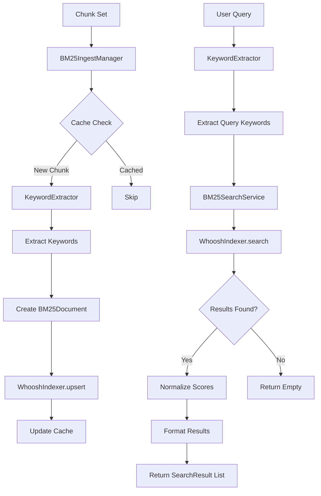

# BM25 Module — Keyword-based Search and Indexing

Version: Detailed BM25 module for RAG (Retrieval-Augmented Generation) system.

**Short description**: The `BM25/` directory contains components implementing the BM25 algorithm for keyword-based search, including indexing with Whoosh, keyword extraction with spaCy, and search service. This module provides an alternative retrieval method alongside vector similarity search.

## ✨ Key Features

- 🔍 **Keyword-based Retrieval**: BM25 algorithm for traditional information retrieval
- 🌐 **Multi-language Support**: Keyword extraction in English and Vietnamese
- 🏗️ **Whoosh Integration**: Efficient indexing and search backend
- 🔄 **Hybrid Search**: Complements semantic vector search
- 📊 **Scoring Algorithm**: BM25F scoring with multi-field support

## 🚀 Quick Start

### Install Dependencies

```bash
# Install core dependencies
pip install -r requirements.txt

# Install spaCy models for keyword extraction
python -c "import spacy; spacy.cli.download('en_core_web_sm')"
pip install spacy-udpipe
python -c "import spacy_udpipe; spacy_udpipe.download('vi')"
```

### Basic Usage

The module provides keyword-based search capabilities integrated with the RAG pipeline.

## Kiến trúc tổng quan

Thư mục `BM25/` gồm các phần chính:

- `ingest_manager.py` — Điều phối ingest chunks vào BM25 index
- `whoosh_indexer.py` — Whoosh backend cho indexing và search
- `search_service.py` — High-level search service với scoring
- `keyword_extractor.py` — Trích xuất keywords bằng spaCy
- `__init__.py` — Module initialization

Luồng dữ liệu điển hình:

```text
PDF Chunks → BM25IngestManager → KeywordExtractor → WhooshIndexer → BM25 Index
User Query → KeywordExtractor → BM25SearchService → WhooshIndexer → Results
```

## 📁 Directory Contents

- `ingest_manager.py` — Coordinates chunk ingestion into BM25 index
- `whoosh_indexer.py` — Whoosh backend for indexing and search
- `search_service.py` — High-level search service with scoring
- `keyword_extractor.py` — Keyword extraction using spaCy
- `bm25_manager.py` — Main coordinator for BM25 operations

## 🔧 Component Design & Behavior

### ingest_manager.py

- **Purpose**: Coordinates chunk ingestion into BM25 index
- **Features**:
  - Convert chunks to BM25Document format
  - Cache management to avoid duplicate indexing
  - Batch processing for performance
  - Error handling and logging

### whoosh_indexer.py

- **Purpose**: Whoosh backend for BM25 indexing and search
- **Features**:
  - Schema definition for BM25 fields
  - Upsert/delete documents
  - BM25F scoring algorithm
  - Multi-field search (content + keywords)

### search_service.py

- **Purpose**: High-level search service with score normalization
- **Features**:
  - Query preprocessing with keyword extraction
  - Score normalization (z-score)
  - Result formatting
  - Safeguards for small result sets

### keyword_extractor.py

- **Purpose**: Extract keywords from text using spaCy
- **Features**:
  - Multi-language support (English, Vietnamese)
  - Lemma extraction and noun phrases
  - Language detection heuristics
  - Lazy loading spaCy models

## 🔌 API Contract

### Inputs/Outputs
- **Input**: Text chunks for indexing, search queries for retrieval
- **Output**: Indexed documents, ranked search results with scores
- **Error Handling**: Graceful fallback when indexing/search fails

## 💡 Usage Examples

### Basic Usage

```python
from BM25.bm25_manager import BM25Manager

# Initialize BM25 manager
bm25 = BM25Manager(index_dir="data/bm25_index")

# Index documents
bm25.index_chunks(chunk_set)

# Search
results = bm25.search("machine learning", top_k=10)
```

### Integration with Pipeline

The BM25 module integrates with the main RAG pipeline for hybrid retrieval.

# Search với cả hai methods
vector_results = self.search_similar(faiss_file, metadata_file, query, top_k=5)
bm25_results = self.search_bm25(query, top_k=5)
```

## 🔌 API Contract

### Inputs/Outputs
- **Input** for `BM25IngestManager.ingest_chunk_set()`: ChunkSet object
- **Output**: Number of chunks successfully indexed (int)
- **Input** for `BM25SearchService.search()`: query string, top_k, normalize_scores
- **Output**: List[SearchResult] with raw_score and normalized_score

## ⚠️ Operational Notes

### Edge Cases
- Missing spaCy model: Fallback to basic tokenization
- Whoosh index corruption: Recreate index
- Small result sets: Skip z-score normalization
- Memory constraints: Batch processing for large datasets

### Logging & Debugging
- Detailed logging for ingest operations
- Debug info for search queries and scoring
- Performance metrics for indexing speed

## 🧪 Testing & Validation

```powershell
# Test BM25 components
python -m pytest test/bm25/ -v
```

## 🤝 Contributing

### Guidelines
- Write comments and docstrings in Vietnamese
- Handle spaCy import errors gracefully
- Use protocol interfaces for testability
- Add proper error handling for Whoosh operations

## 📚 Technical Reference

### Integration Points
- **Pipeline**: `pipeline/rag_pipeline.py` — main integration point
- **Loaders**: `loaders/model/` — chunk data structures
- **Config**: `config/app.yaml` — BM25 settings

### Implementation Notes
- Whoosh library required (add to requirements.txt)
- spaCy models available (en_core_web_sm, vi_udpipe)
- UTF-8 encoding for text processing

### Key Implementation Files

#### `BM25/ingest_manager.py` — BM25 Ingest Manager
- **Main class**: `BM25IngestManager`
- **Constructor**: `__init__(indexer, cache_path)`
- **Methods**:
  - `ingest_chunk_set(chunk_set)` — main ingest method
  - `_chunk_to_document(chunk)` — convert chunk to BM25Document
  - `_load_cache()` / `_save_cache()` — cache management
- **Data structures**:
  - `BM25Document` dataclass: document_id, content, keywords, metadata

#### `BM25/whoosh_indexer.py` — Whoosh Indexer
- **Main class**: `WhooshIndexer`
- **Constructor**: `__init__(index_dir, recreate=False)`
- **Methods**:
  - `upsert_documents(documents)` — bulk insert/update
  - `delete_documents(document_ids)` — bulk delete
  - `search(terms, limit=10)` — raw search
- **Schema**: ID, TEXT(content), KEYWORD(keywords), STORED(metadata)

#### `BM25/search_service.py` — BM25 Search Service

- Class chính: `BM25SearchService`
- Constructor: `__init__(indexer)`
- Methods:
  - `search(query, top_k=5, normalize_scores=True)` — main search
  - `_normalize_scores(results)` — z-score normalization

- Data structures:
  - `SearchResult`: document_id, raw_score, normalized_score, keywords, text, metadata

### `BM25/keyword_extractor.py` — Keyword Extractor

- Class chính: `KeywordExtractor`
- Constructor: `__init__(language_models=None)`
- Methods:
  - `extract_keywords(text, language=None)` — main extraction
  - `_load_nlp(language)` — lazy spaCy model loading
  - `_detect_language(text)` — language detection

- **Supported languages**: English (en_core_web_sm), Vietnamese (vi_udpipe via spaCy-UDPipe)

## 🔌 API Contract

### Data Shapes
- `ingest_chunk_set()` return: `int` (number of documents indexed)
- `search()` return: `List[SearchResult]` with fields:
  - `document_id: str`
  - `raw_score: float`
  - `normalized_score: float`
  - `keywords: List[str]`
  - `text: str`
  - `metadata: dict`

## 💡 Usage Examples

```python
from BM25.ingest_manager import BM25IngestManager
from BM25.whoosh_indexer import WhooshIndexer
from BM25.search_service import BM25SearchService
from pathlib import Path

# Setup indexer
index_dir = Path("data/bm25_index")
indexer = WhooshIndexer(index_dir)

# Setup ingest manager with cache
cache_file = Path("data/cache/bm25_chunk_cache.json")
ingest_manager = BM25IngestManager(
    indexer=indexer,
    cache_path=cache_file
)

# Ingest chunks (from pipeline)
indexed = ingest_manager.ingest_chunk_set(chunk_set)
print(f"Indexed {indexed} chunks")

# Setup search service
search_service = BM25SearchService(indexer)

# Search
results = search_service.search(
    query="machine learning algorithms",
    top_k=5,
    normalize_scores=True
)

for result in results:
    print(f"Doc: {result.document_id}")
    print(f"Score: {result.normalized_score:.4f}")
    print(f"Text: {result.text[:100]}...")
```

## 🏗️ Architecture Overview



ASCII fallback:

```text
BM25 Flow:
1) Chunk ingestion: ChunkSet → KeywordExtractor → BM25Document → Whoosh index
2) Query processing: Query → KeywordExtractor → Whoosh search → Score normalization
3) Cache management: Avoid re-indexing duplicate chunks
4) Error handling: Graceful fallback when spaCy/Whoosh unavailable
```

## 🔗 Integration Points

- **Keyword extraction**: `KeywordExtractor.extract_keywords()`
- **Index operations**: `WhooshIndexer.upsert_documents()`
- **Score normalization**: `BM25SearchService._normalize_scores()`
- **Cache management**: `BM25IngestManager._load_cache()`

## 🧪 Testing Guidelines

- Mock spaCy models for unit tests
- Test with small Whoosh indexes
- Verify keyword extraction accuracy
- Test cache behavior with duplicate chunks
