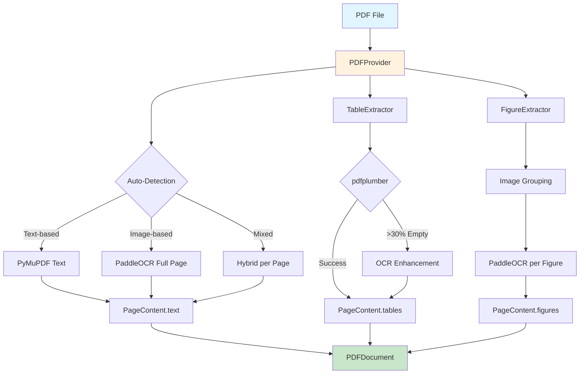

# PDFLoaders Module — Smart PDF Processing with OCR Integration

[](https://www.python.org/downloads/)
[](../../LICENSE)

The PDFLoaders module provides an intelligent PDF processing system capable of automatically detecting PDF types (text-based vs image-based) and integrating OCR to extract content from tables and images. It follows the Single Responsibility principle: each extractor handles its own specific task (text, tables, figures, OCR). This is the first component in the RAG pipeline: `PDF → PDFProvider → PDFDocument → SemanticChunker → ...`

## ✨ Key Features

- 🔍 **Smart Auto-Detection**: Automatically detects text-based vs image-based PDFs (>50 characters per page)
- 📄 **Multi-Modal Extraction**: Extracts text, tables, and figures with OCR enhancement
- 🧩 **Modular Architecture**: Uses factory patterns, composition design, and dependency injection
- 🌐 **Multi-Language OCR**: Supports 20+ languages with PaddleOCR
- 📊 **Table Enhancement**: Combines pdfplumber with OCR fallback when >30% cells are empty
- 🖼️ **Figure Processing**: Groups images and extracts OCR text per figure
- 🔄 **Graceful Degradation**: Falls back gracefully when OCR/services are unavailable
- 📈 **Performance Optimized**: Memory-efficient processing with progress tracking

## 🚀 Quick Start

### Install Dependencies

```bash
# Install core dependencies
pip install -r PDFLoaders/requirements/requirements.txt

# Download PaddleOCR models (auto-downloaded on first use)
# Models stored in ~/.paddleocr/
```

### Basic Usage

The module provides a simple interface to load PDFs with automatic OCR detection and content extraction.

## 📁 Directory Structure

```text
PDFLoaders/
├── pdf_provider.py          # Re-export main classes
├── README.md               # This documentation
├── provider/               # Core processing logic
│   ├── pdf_provider.py     # Main PDFProvider class
│   ├── simple_provider.py  # SimpleTextProvider
│   ├── models.py           # Data models (PDFDocument, PageContent)
│   └── extractors/         # Specialized extractors
│       ├── ocr_extractor.py    # OCRExtractor with PaddleOCR
│       ├── table_extractor.py  # TableExtractor with pdfplumber
│       └── figure_extractor.py # FigureExtractor with image grouping
├── configs/                # Configuration files
├── models/                 # Pre-trained models for OCR
├── pdf_extract_kit/        # Utility tools
└── requirements/           # Separate dependencies
```

### Data Flow Architecture



**PDF Processing Flow:**

1. **Auto-Detection**: Analyzes each page (>50 characters = text-based, <50 = image-based)
2. **Text Extraction**: Uses PyMuPDF for text-based, PaddleOCR for image-based
3. **Table Processing**: pdfplumber as primary, OCR enhancement when needed
4. **Figure Processing**: Groups images and extracts OCR text
5. **Aggregation**: Combines everything into PDFDocument with PageContent list

## 📋 Contract (Inputs / Outputs / Error Modes)

### Inputs
- **PDF Path**: File path to the PDF document
- **Configuration**: PDFProvider configuration with OCR settings

### Outputs
- **PDFDocument**: Dataclass containing metadata and PageContent list
- **PageContent**: Per-page content including text, tables, and figures

### Error Modes
- **FileNotFoundError**: PDF file does not exist
- **PDFLoadError**: PDF is corrupted or cannot be read
- **OCRError**: OCR service failure with graceful fallback to empty content
- **MemoryError**: Large PDFs with many images

## 🔧 Component Design & Behavior

### PDFProvider (provider/pdf_provider.py)

The main class orchestrates PDF processing with intelligent logic. It automatically detects whether each page is text-based or image-based using a character threshold. It integrates all extractors and provides both simple and progress-tracked loading methods.

### OCRExtractor (provider/extractors/ocr_extractor.py)

Handles OCR processing using the PaddleOCR engine. It supports multiple languages through automatic mapping and provides graceful degradation when OCR fails. The extractor can process both individual images and full PDF pages.

### TableExtractor (provider/extractors/table_extractor.py)

Extracts tables from PDF pages using pdfplumber as the primary method. When tables have more than 30% empty cells, it automatically enhances them with OCR text. This ensures comprehensive table content extraction.

### FigureExtractor (provider/extractors/figure_extractor.py)

Processes images and diagrams by grouping related images based on position and size. It then extracts OCR text from each figure group and stores the results. The extractor is designed to be memory-efficient for large documents.

## 📊 Data Models

### PDFDocument
A dataclass that represents a complete PDF document with its filename, pages, and metadata such as file size and page count.

### PageContent
A dataclass for each page's content including the main text (from PyMuPDF or OCR), extracted tables with OCR enhancement, and figures with OCR text.

**Table Structure:**
Contains page number, bounding box, table data array, OCR enhancement flag, and empty cell ratio.

**Figure Structure:**
Contains page number, bounding box, optional image data, OCR extracted text, and grouping identifier.

## 💡 Usage Examples

### Basic Usage
Load a PDF with automatic OCR detection and access the extracted content including text, tables, and figures.

### Advanced Configuration
Force OCR for all pages (useful for scanned PDFs), disable OCR completely (for pure text PDFs), or adjust the auto-detection threshold.

### Direct Extractor Usage
Use individual extractors directly for specific processing needs, such as OCR on images or table extraction with OCR enhancement.

### Progress Tracking for Large PDFs
Monitor processing progress for large documents with custom callback functions.

## 🧪 Testing

### Unit Tests
Test individual components like PDF loading, OCR extraction, and table processing.

### Integration Tests
Test complete workflows with sample PDFs to verify content extraction quality.

## 📦 Dependencies & Installation

### Core Dependencies
Essential libraries for PDF processing, OCR, and image handling.

### Installation
Install from the requirements file and download OCR models automatically.

### Optional Dependencies
Additional tools for testing, code formatting, and type checking.

## ⚠️ Operational Notes

### Performance Considerations
Memory usage increases with large PDFs containing many images. OCR processing takes 2-5 seconds per page depending on language. Consider caching for repeated processing and process page-by-page for large documents.

### Error Handling
OCR failures result in empty content with warning logs. Corrupted PDFs raise descriptive errors. Missing dependencies provide clear installation instructions. Memory limits are managed with automatic image cleanup.

### Language Support
Primary support for English, Vietnamese, and Chinese. Additional European languages, Cyrillic scripts, and other writing systems are available.

### Best Practices
Use auto-detection for most cases. Match OCR language to PDF content. Adjust thresholds for specific document types. Monitor logs for OCR issues and enhancement triggers. Use progress tracking for large PDFs.

## 🔧 Troubleshooting

### Common Issues

**OCR Not Working:**
Verify PaddleOCR installation and test with a simple image to ensure the OCR engine is functioning.

**Table OCR Enhancement Not Triggering:**
Check that tables have more than 30% empty cells, verify OCR extractor initialization, and examine logs for enhancement messages.

**Memory Issues with Large PDFs:**
Process documents page-by-page instead of loading everything at once, and force garbage collection between pages.

**Auto-Detection Incorrect:**
Debug the detection logic by checking character counts per page and comparing against the threshold to understand why pages are classified incorrectly.

### Debug Logging
Enable detailed logging for the PDF provider and OCR extractor to troubleshoot issues and monitor processing behavior.

## 📚 API Reference

### PDFProvider
- `load(pdf_path)` → PDFDocument
- `load_with_progress(pdf_path, progress_callback)` → PDFDocument
- `__init__(use_ocr, ocr_lang, min_text_threshold)`

### OCRExtractor
- `extract_text(image)` → string
- `extract_page_ocr(page_fitz)` → string
- `test_connection()` → boolean
- `__init__(lang)`

### TableExtractor
- `extract_tables(page_fitz, page_num)` → list of dictionaries
- `__init__(ocr_extractor)`

### FigureExtractor
- `extract_figures(page_fitz, page_num)` → list of dictionaries
- `__init__(ocr_extractor)`

## 🤝 Contributing

### Adding New Extractors
Extend the base extractor interface, add to the extractors module, integrate with PDFProvider, create comprehensive tests, and update documentation.

### Language Support Extension
Add new language codes to the mapping, test with sample documents, and update documentation.

### Performance Improvements
Implement result caching, add parallel processing, optimize memory usage, and enhance progress callbacks.

## 📄 License

This module is part of the RAG Pipeline project and is licensed under the MIT License - see the [LICENSE](../../LICENSE) file for details.

## 👥 Authors

- **@Flowerf19** - Nguyen Hoa (Hoaf.n.v@gmail.com) - Lead Developer
- **@lybachpha** - LeeWar (Bachien0987@gmail.com) - Core Contributor

---

*The PDFLoaders module is the first component in the RAG pipeline, ensuring accurate and efficient PDF content extraction for subsequent processing steps.*</content>
<parameter name="filePath">d:\Project\RAG-2\PDFLoaders\README.md