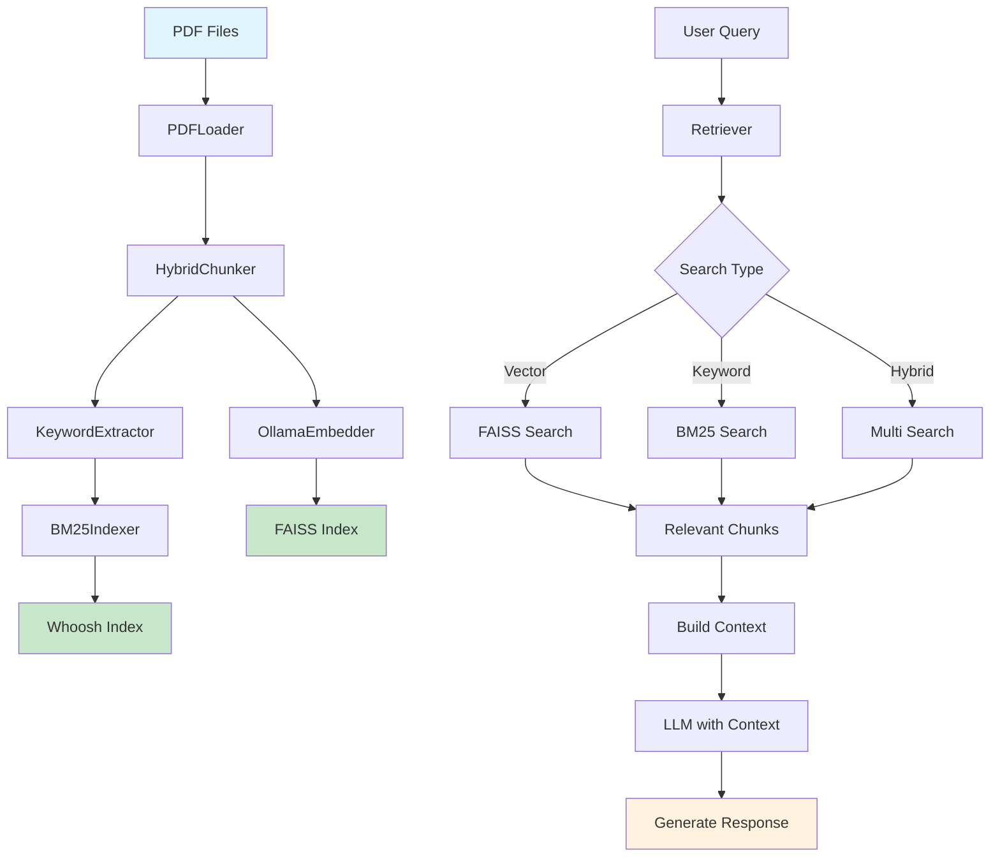

# RAG Pipeline - Retrieval-Augmented Generation System

[](https://www.python.org/downloads/)
[](LICENSE)

Hệ thống RAG (Retrieval-Augmented Generation) modular, xử lý PDF thành FAISS vector index và BM25 keyword index cho tìm kiếm ngữ nghĩa và keyword-based siêu nhanh. Hỗ trợ multiple LLM providers (Ollama, OpenAI, Google Gemini) với giao diện Streamlit.

## ✨ Tính năng chính

- 🔍 **Dual Retrieval**: Vector similarity (FAISS) + Keyword search (BM25)
- 📄 **PDF Processing**: Text extraction, table parsing, multi-language support
- 🧩 **Modular Architecture**: Factory patterns, composition design
- 🤖 **Multi-LLM Support**: Ollama, OpenAI, Google Gemini
- 🧠 **Multi-Embedder Support**: HuggingFace Local/API, Ollama Local
- 🎨 **Modern UI**: Streamlit interface với chat và retrieval
- 📊 **Analytics**: Processing statistics, performance monitoring
- 🔄 **Incremental Processing**: Cache-based để tránh re-processing

## 🚀 Khởi động nhanh

### Yêu cầu hệ thống

- **Python**: >= 3.13
- **Ollama**: Server chạy tại `http://localhost:11434`
- **Models**: `embeddinggemma:latest`, `bge-m3:latest`
- **spaCy**: `en_core_web_sm`, `vi_core_news_lg`

### Cài đặt

```bash
# Clone repository
git clone <repository-url>
cd RAG

# Tạo virtual environment
python -m venv .venv
py -3 -m venv .venv
.venv\Scripts\Activate.ps1  # Windows
# source .venv/bin/activate  # Linux/Mac

# Cài đặt dependencies
pip install -r requirements.txt

# Cài đặt spaCy models
python -c "import spacy; spacy.cli.download('en_core_web_sm')"
python -c "import spacy; spacy.cli.download('vi_core_news_lg')"
```

### Khởi động Ollama

```bash
# Cài đặt và khởi động Ollama (nếu chưa có)
# Download từ: https://ollama.ai/download

# Pull required models
ollama pull embeddinggemma:latest
ollama pull bge-m3:latest

# Verify models
ollama list
```

### Chạy pipeline

```powershell
# Xử lý tất cả PDF trong data/pdf/
python run_pipeline.py

# Hoặc xử lý file cụ thể
python -c "from pipeline import RAGPipeline; p = RAGPipeline(); p.process_pdf('path/to/file.pdf')"
```

### Chạy giao diện web

```powershell
# Streamlit UI với tính năng Embedding
streamlit run llm/LLM_FE.py

# Truy cập: http://localhost:8501
```

#### Tính năng Embedding trong UI

**🎛️ Điều khiển Embedding:**
- **Nút "🚀 Run Embedding"**: Chạy embedding cho tất cả PDF trong `data/pdf/`
- **Thanh tiến độ**: Hiển thị tiến trình xử lý từng file
- **Nút "⏹️ Dừng Embedding"**: Dừng quá trình embedding
- **Chuyển đổi Embedder**: Chọn giữa HuggingFace Local/API hoặc Ollama

**📊 Theo dõi tiến độ:**
- Số file PDF được tìm thấy
- File đang xử lý hiện tại
- Phần trăm hoàn thành
- Trạng thái chi tiết

### Cấu hình Embedder

Hệ thống hỗ trợ multiple embedding providers:

- **HuggingFace Local**: Download và chạy BGE-M3 1024-dim locally (default)
- **HuggingFace API**: Sử dụng FREE Inference API với E5-Large Multilingual 1024-dim (cần token)
- **Ollama Local**: Ollama server với embedding models (Gemma 768-dim, BGE-M3 1024-dim)

#### Model Specifications:

| Provider | Model | Dimensions | Max Tokens | Multilingual | Languages | Cost |
|----------|-------|------------|------------|--------------|-----------|------|
| HF Local | BAAI/bge-m3 | **1024** | 8192 | ✅ | 100+ | FREE |
| HF API | intfloat/multilingual-e5-large | **1024** | 512 | ✅ | **100+** | FREE |
| Ollama | embeddinggemma | 768 | 8192 | ✅ | 100+ | FREE |
| Ollama | bge-m3 | 1024 | 8192 | ✅ | 100+ | FREE |

**Lưu ý**: 
- HF API sử dụng endpoint mới: `https://router.huggingface.co/hf-inference/` (migrated từ `api-inference.huggingface.co` - deprecated Nov 2025)
- **E5-Large Multilingual** hỗ trợ 100+ ngôn ngữ bao gồm tiếng Việt, tiếng Anh, tiếng Trung, etc.
- **BGE-M3** (local) cũng hỗ trợ đa ngôn ngữ tốt, phù hợp khi không có internet
- Cả hai đều cho embeddings 1024 dimensions và hoàn toàn MIỄN PHÍ

```bash
# HuggingFace API token (optional - cho HF API mode)
export HF_TOKEN="hf_xxxxxxxxxxxxxxxxxxxxxxxxxxxxxxxxx"
# hoặc
export HUGGINGFACE_TOKEN="hf_xxxxxxxxxxxxxxxxxxxxxxxxxxxxxxxxx"

# Ví dụ setup trong Linux/Mac:
export HF_TOKEN="hf_xxxxxxxxxxxxxxxxxxxxxxxxxxxxxxxxx"

# Hoặc trong Windows PowerShell:
$env:HF_TOKEN="hf_xxxxxxxxxxxxxxxxxxxxxxxxxxxxxxxxx"
```

**Cách 2: Sử dụng Streamlit secrets.toml** (khuyến nghị cho development)
```toml
# File: .streamlit/secrets.toml
[huggingface]
api_token = "hf_xxxxxxxxxxxxxxxxxxxxxxxxxxxxxxxxx"
# hoặc
hf_token = "hf_xxxxxxxxxxxxxxxxxxxxxxxxxxxxxxxxx"
```

**Cách lấy HuggingFace Token (MIỄN PHÍ):**
1. Truy cập [https://huggingface.co/settings/tokens](https://huggingface.co/settings/tokens)
2. Đăng nhập tài khoản HuggingFace (hoặc đăng ký miễn phí)
3. Tạo "New token" với type "Read"
4. Copy token và thiết lập như hướng dẫn trên

**Lưu ý**: HuggingFace Inference API hoàn toàn MIỄN PHÍ cho BGE-M3 model!

Trong UI, chọn embedder phù hợp trong sidebar "Embedder source".

## 📁 Cấu trúc project

```text
RAG/
├── pipeline/          # Core orchestration, FAISS, retriever
├── loaders/           # PDF processing, text/table extraction
├── chunkers/          # Text chunking strategies
├── embedders/         # Ollama embedding providers
├── llm/              # LLM integration (API, local, UI)
├── BM25/             # Keyword-based search (Whoosh)
├── data/             # Processed data và indexes
├── config/           # Configuration files
├── prompts/          # System prompts
├── tests/            # Unit và integration tests
├── requirements.txt  # Python dependencies
├── run_pipeline.py   # Main entry point
└── README.md         # Documentation
```

### Data Flow Architecture



**Luồng RAG hoạt động:**

1. **Indexing Phase**: PDF → Chunks → Embeddings → FAISS/BM25 Indexes
2. **Retrieval Phase**: Query → Search Indexes → Relevant Chunks
3. **Generation Phase**: Query + Relevant Chunks → LLM → Response

## 🔧 Sử dụng trong code

### Basic Pipeline Usage

```python
from pipeline import RAGPipeline
from pathlib import Path

# Initialize pipeline
pipeline = RAGPipeline()

# Process PDF
pdf_path = Path("data/pdf/document.pdf")
pipeline.process_pdf(pdf_path)

# Search with vector similarity
results = pipeline.search_similar(
    faiss_file=Path("data/vectors/document_vectors_20251021.faiss"),
    metadata_map_file=Path("data/vectors/document_metadata_map_20251021.pkl"),
    query_text="machine learning algorithms",
    top_k=5
)

# Search with BM25
bm25_results = pipeline.search_bm25("query text", top_k=5)

# Combined search
hybrid_results = pipeline.hybrid_search("query", vector_weight=0.7, bm25_weight=0.3)
```

### LLM Integration

```python
from llm import LLMAPI, LLMLocal

# OpenAI/Gemini API
api_llm = LLMAPI()
response = api_llm.generate_response("Explain RAG systems")

# Local Ollama
local_llm = LLMLocal()
response = local_llm.generate_response("Explain RAG systems")
```

### Custom Chunking

```python
from chunkers import HybridChunker
from chunkers.model import ChunkerMode

# Configure chunker
chunker = HybridChunker(
    max_tokens=200,
    overlap_tokens=20,
    mode=ChunkerMode.AUTO
)

# Process document
chunk_set = chunker.chunk(pdf_document)
```

## 🧪 Testing

```powershell
# Run all tests
python -m pytest -v --cov=.

# Test specific modules
python -m pytest tests/pipeline/ -v
python -m pytest tests/loaders/ -v
python -m pytest tests/chunkers/ -v

# Integration tests
python -m pytest tests/e2e/ -v
```

## 📊 Performance & Monitoring

### Benchmark Results

- **PDF Processing**: ~50 pages/minute
- **Vector Search**: < 10ms cho 10K documents
- **BM25 Search**: < 5ms cho keyword queries
- **Memory Usage**: ~2GB cho 1K documents

### Monitoring Commands

```powershell
# Check FAISS index integrity
python -c "from pipeline.vector_store import VectorStore; store = VectorStore(); index = store.load_index('data/vectors/doc.faiss'); print(f'Vectors: {index.ntotal}')"

# View processing statistics
python -c "import json; data = json.load(open('data/batch_summary_*.json')); print(f'Processed: {data[\"total_files\"]} files')"
```

## 🔧 Configuration

### Environment Variables

```bash
# LLM Configuration
export OPENAI_API_KEY="your-key"
export GOOGLE_API_KEY="your-key"
export OLLAMA_BASE_URL="http://localhost:11434"

# System Configuration
export RAG_DATA_DIR="./data"
export RAG_CACHE_DIR="./data/cache"
export RAG_LOG_LEVEL="INFO"
```

### YAML Configuration (`config/app.yaml`)

```yaml
llm:
  default_provider: "ollama"
  models:
    embedding: "embeddinggemma:latest"
    generation: "llama2:7b"

processing:
  chunk_size: 200
  overlap: 20
  batch_size: 32

search:
  vector_top_k: 5
  bm25_top_k: 5
  hybrid_weight_vector: 0.7
  hybrid_weight_bm25: 0.3
```

## 🚨 Troubleshooting

### Common Issues

#### Ollama Connection Failed

```bash
# Check Ollama status
curl http://localhost:11434/api/tags

# Restart Ollama service
ollama serve
```

#### PDF Processing Errors

```powershell
# Clear cache and re-process
Remove-Item "data\cache\*.json" -Force
python run_pipeline.py
```

#### Memory Issues

```powershell
# Reduce batch size in config
# Use smaller embedding model
ollama pull embeddinggemma:latest  # Instead of bge-m3
```

#### Streamlit Errors

```powershell
# Clear Streamlit cache
streamlit cache clear
streamlit run llm/LLM_FE.py --server.port 8501
```

### Debug Tools

```powershell
# Debug chunking
python chunkers/chunk_pdf_demo.py

# Debug embeddings
python -c "from embedders import OllamaEmbedder; emb = OllamaEmbedder(); print(emb.embed_text('test'))"

# Debug LLM
python -c "from llm import LLMLocal; llm = LLMLocal(); print(llm.generate_response('Hello'))"
```

## 🤝 Contributing

### Development Setup

```bash
# Fork and clone
git clone https://github.com/your-username/RAG.git
cd RAG

# Create feature branch
git checkout -b feature/new-feature

# Install dev dependencies
pip install -r requirements-dev.txt

# Run tests before committing
python -m pytest
```

### Code Standards

- **Language**: Vietnamese comments, English docstrings
- **Style**: Black formatter, isort imports
- **Testing**: pytest với coverage > 80%
- **Documentation**: Update README cho breaking changes

### Architecture Guidelines

- **Composition over Inheritance**: Use composition patterns
- **Factory Methods**: For complex object creation
- **Protocol Interfaces**: For testability
- **Error Handling**: Graceful degradation

## 📈 Roadmap

### Phase 1 (Current)

- ✅ PDF processing pipeline
- ✅ FAISS vector search
- ✅ BM25 keyword search
- ✅ Multi-LLM support
- ✅ Streamlit UI

### Phase 2 (Next)

- 🔄 Incremental processing
- 🔄 Cloud storage support
- 🔄 Advanced chunking strategies
- 🔄 Query expansion
- 🔄 Multi-modal support

### Phase 3 (Future)

- 🔄 Distributed processing
- 🔄 Real-time indexing
- 🔄 Advanced analytics
- 🔄 Plugin architecture
- 🔄 Web API

## 📝 License

MIT License - see [LICENSE](LICENSE) file for details.

## 🙏 Acknowledgments

- **FAISS**: Facebook AI Similarity Search
- **Ollama**: Local LLM inference
- **spaCy**: Industrial-strength NLP
- **Whoosh**: Pure Python search engine
- **Streamlit**: Fast web apps for ML

## 📞 Support

- **Issues**: [GitHub Issues](https://github.com/your-username/RAG/issues)
- **Discussions**: [GitHub Discussions](https://github.com/your-username/RAG/discussions)
- **Documentation**: See module READMEs for technical details
