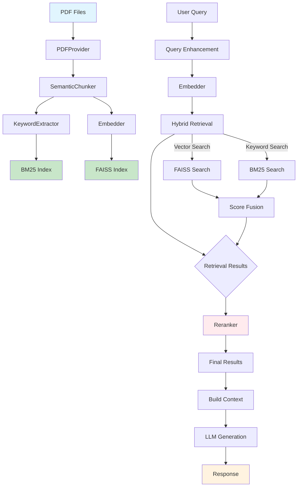

# RAG Pipeline - Retrieval-Augmented Generation System

[](https://www.python.org/downloads/)
[](LICENSE)

Hệ thống RAG (Retrieval-Augmented Generation) modular, xử lý PDF thành FAISS vector index và BM25 keyword index cho tìm kiếm ngữ nghĩa và keyword-based siêu nhanh. Hỗ trợ multiple LLM providers (Ollama, OpenAI, Google Gemini) với giao diện Streamlit và reranking để cải thiện độ chính xác.

## ✨ Tính năng chính

- 🔍 **Hybrid Retrieval**: Vector similarity (FAISS) + Keyword search (BM25) + Reranking
- 📄 **Advanced PDF Processing**: Text extraction, table parsing, OCR, multi-language support
- 🧩 **Modular Architecture**: Factory patterns, composition design, dependency injection
- 🤖 **Multi-LLM Support**: Ollama, OpenAI, Google Gemini
- 🧠 **Multi-Embedder Support**: HuggingFace Local/API, Ollama Local
- � **Query Enhancement**: QEM (Query Enhancement Module) cho cải thiện truy vấn
- �🎨 **Modern UI**: Streamlit interface với chat và retrieval
- 📊 **Analytics**: Processing statistics, performance monitoring
- 🔄 **Incremental Processing**: Cache-based để tránh re-processing
- 🔧 **Graceful Degradation**: Tự động fallback khi services không khả dụng

## 🚀 Khởi động nhanh

### Yêu cầu hệ thống

- **Python**: 3.10 (khuyến nghị - đã test và tương thích với tất cả dependencies)
- **Ollama**: Server chạy tại `http://localhost:11434`
- **Models**: `embeddinggemma:latest`, `bge-m3:latest`
- **spaCy**: `en_core_web_sm`, `vi_core_news_lg`

### Cài đặt

```bash
# Clone repository
git clone https://github.com/Flowerf19/RAG.git
cd RAG

# Tạo virtual environment
python -m venv .venv
py -3.10 -m venv .venv  # Sử dụng Python 3.10 cụ thể
.venv\Scripts\Activate.ps1  # Windows
# source .venv/bin/activate  # Linux/Mac

# Cài đặt dependencies
pip install -r requirements.txt

# Cài đặt spaCy models
python -c "import spacy; spacy.cli.download('en_core_web_sm')"
python -c "import spacy; spacy.cli.download('vi_core_news_lg')"
```

### Khởi động Ollama

```bash
# Cài đặt và khởi động Ollama (nếu chưa có)
# Download từ: https://ollama.ai/download

# Pull required models
ollama pull embeddinggemma:latest
ollama pull bge-m3:latest

# Verify models
ollama list
```

### Chạy pipeline

```powershell
# Xử lý tất cả PDF trong data/pdf/
python -c "from pipeline.rag_pipeline import RAGPipeline; RAGPipeline().process_directory('data/pdf')"

# Hoặc xử lý file cụ thể
python -c "from pipeline.rag_pipeline import RAGPipeline; p = RAGPipeline(); p.process_pdf('path/to/file.pdf')"
```

### Chạy giao diện web

```powershell
# Streamlit UI với tính năng Embedding và Chat
streamlit run ui/app.py

# Truy cập: http://localhost:8501
```

#### Tính năng Embedding trong UI

**🎛️ Điều khiển Embedding:**
- **Nút "🚀 Run Embedding"**: Chạy embedding cho tất cả PDF trong `data/pdf/`
- **Thanh tiến độ**: Hiển thị tiến trình xử lý từng file
- **Nút "⏹️ Dừng Embedding"**: Dừng quá trình embedding
- **Chuyển đổi Embedder**: Chọn giữa HuggingFace Local/API hoặc Ollama

**📊 Theo dõi tiến độ:**
- Số file PDF được tìm thấy
- File đang xử lý hiện tại
- Phần trăm hoàn thành
- Trạng thái chi tiết

### Cấu hình Embedder

Hệ thống hỗ trợ multiple embedding providers:

- **HuggingFace Local**: Download và chạy BGE-M3 1024-dim locally (default)
- **HuggingFace API**: Sử dụng FREE Inference API với E5-Large Multilingual 1024-dim (cần token)
- **Ollama Local**: Ollama server với embedding models (Gemma 768-dim, BGE-M3 1024-dim)

#### Model Specifications:

| Provider | Model | Dimensions | Max Tokens | Multilingual | Languages | Cost |
|----------|-------|------------|------------|--------------|-----------|------|
| HF Local | BAAI/bge-m3 | **1024** | 8192 | ✅ | 100+ | FREE |
| HF API | intfloat/multilingual-e5-large | **1024** | 512 | ✅ | **100+** | FREE |
| Ollama | embeddinggemma | 768 | 8192 | ✅ | 100+ | FREE |
| Ollama | bge-m3 | 1024 | 8192 | ✅ | 100+ | FREE |

**Lưu ý**: 
- HF API sử dụng endpoint mới: `https://router.huggingface.co/hf-inference/` (migrated từ `api-inference.huggingface.co` - deprecated Nov 2025)
- **E5-Large Multilingual** hỗ trợ 100+ ngôn ngữ bao gồm tiếng Việt, tiếng Anh, tiếng Trung, etc.
- **BGE-M3** (local) cũng hỗ trợ đa ngôn ngữ tốt, phù hợp khi không có internet
- Cả hai đều cho embeddings 1024 dimensions và hoàn toàn MIỄN PHÍ

```bash
# HuggingFace API token (optional - cho HF API mode)
export HF_TOKEN="hf_xxxxxxxxxxxxxxxxxxxxxxxxxxxxxxxxx"
# hoặc
export HUGGINGFACE_TOKEN="hf_xxxxxxxxxxxxxxxxxxxxxxxxxxxxxxxxx"

# Ví dụ setup trong Linux/Mac:
export HF_TOKEN="hf_xxxxxxxxxxxxxxxxxxxxxxxxxxxxxxxxx"

# Hoặc trong Windows PowerShell:
$env:HF_TOKEN="hf_xxxxxxxxxxxxxxxxxxxxxxxxxxxxxxxxx"
```

**Cách 2: Sử dụng Streamlit secrets.toml** 
```toml
# File: .streamlit/secrets.toml
[huggingface]
api_token = "hf_xxxxxxxxxxxxxxxxxxxxxxxxxxxxxxxxx"
# hoặc
hf_token = "hf_xxxxxxxxxxxxxxxxxxxxxxxxxxxxxxxxx"
```

Trong UI, chọn embedder phù hợp trong sidebar "Embedder source".

- **@Flowerf19** - Nguyễn Hoà (Hoaf.n.v@gmail.com) - Lead Developer
- **@lybachpha** - LeeWar (Bachien0987@gmail.com) - Core Contributor

## 📁 Cấu trúc project

```text
RAG/
├── PDFLoaders/           # PDF processing với OCR integration
│   ├── pdf_provider.py   # Smart PDF loading với PaddleOCR
│   └── pdf_extract_kit/  # Advanced PDF extraction toolkit
├── chunkers/             # Semantic text chunking
│   ├── semantic_chunker.py # spaCy-based chunking
│   └── model/            # Chunk data models
├── embedders/            # Multi-provider embeddings
│   ├── embedder_factory.py # Factory pattern cho embedders
│   └── providers/        # Ollama, HuggingFace implementations
├── pipeline/             # Core RAG orchestration
│   ├── rag_pipeline.py   # Main pipeline orchestrator
│   ├── processing/       # PDF & embedding processing
│   ├── retrieval/        # Hybrid retrieval + reranking
│   ├── storage/          # FAISS, file management
│   └── backend_connector.py # Backward compatibility
├── query_enhancement/    # Query Enhancement Module (QEM)
├── reranking/            # Reranking cho improved accuracy
├── BM25/                 # Keyword-based search (Whoosh)
├── llm/                  # LLM integration (Ollama, Gemini, etc.)
├── ui/                   # Streamlit UI với OOP components
├── data/                 # Processed data và indexes
├── config/               # Configuration files
├── prompts/              # System prompts
├── requirements.txt      # Python dependencies
└── README.md             # Documentation
```

### Data Flow Architecture



**Luồng RAG hoạt động:**

1. **Indexing Phase**: PDF → Chunks → Embeddings → FAISS/BM25 Indexes
2. **Query Enhancement Phase**: User Query → QEM → Enhanced Query
3. **Retrieval Phase**: Enhanced Query → Hybrid Search (Vector + BM25) → Score Fusion
4. **Reranking Phase**: Initial Results → Reranker → Improved Ranking
5. **Generation Phase**: Reranked Results + Query → LLM → Response

**Luồng RAG hoạt động:**

1. **Indexing Phase**: PDF → Chunks → Embeddings → FAISS/BM25 Indexes
2. **Query Enhancement Phase**: User Query → QEM → Enhanced Query
3. **Retrieval Phase**: Enhanced Query → Hybrid Search (Vector + BM25) → Score Fusion
4. **Reranking Phase**: Initial Results → Reranker → Improved Ranking
5. **Generation Phase**: Reranked Results + Query → LLM → Response

### Reranking Support

Hệ thống hỗ trợ multiple reranking providers để cải thiện độ chính xác của kết quả tìm kiếm:

- **BGE-M3 Local**: `BAAI/bge-reranker-v2-m3` (free, high performance)
- **BGE-M3 Ollama**: Ollama-based reranking (no additional dependencies)
- **HuggingFace API**: Cloud-based reranking với API tokens

**Cấu hình Reranking:**
```python
# Trong retrieval orchestrator
reranker = RerankerFactory.create_bge_m3_hf_local(device="cpu")
results = reranker.rerank(query, candidates, top_k=5)
```

## 🔧 Sử dụng trong code

### Basic Pipeline Usage

```python
from pipeline.rag_pipeline import RAGPipeline
from pathlib import Path

# Initialize pipeline
pipeline = RAGPipeline()

# Process PDF directory
pdf_dir = Path("data/pdf")
pipeline.process_directory(pdf_dir)

# Process single PDF
pdf_path = Path("data/pdf/document.pdf")
pipeline.process_pdf(pdf_path)
```

### Advanced Retrieval với Reranking

```python
from pipeline.retrieval.retrieval_orchestrator import fetch_retrieval

# Enhanced retrieval với query enhancement và reranking
results = fetch_retrieval(
    query_text="machine learning algorithms",
    top_k=5,
    embedder_type="ollama",
    reranker_type="bge_m3_hf_local",
    use_query_enhancement=True
)

print(f"Context: {results['context'][:200]}...")
print(f"Sources: {len(results['sources'])} documents")
```

### LLM Integration

```python
from llm.client_factory import LLMClientFactory
from llm import LLMProvider

# Create LLM client
client = LLMClientFactory.create(LLMProvider.GEMINI, config={"api_key": "your-key"})
response = client.generate_response("Explain RAG systems")

# Hoặc sử dụng Ollama
from llm import LLMLocal
local_llm = LLMLocal()
response = local_llm.generate_response("Explain RAG systems")
```

### Custom Chunking với Aggregation

```python
from chunkers.semantic_chunker import SemanticChunker

# Configure chunker với multi-language support
chunker = SemanticChunker(
    max_tokens=200,
    overlap_tokens=20,
    language="vi"  # Support: en, vi, zh, fr, de, es, etc.
)

# Process document (tự động aggregate text + tables + figures)
chunk_set = chunker.chunk(pdf_document)
```

## 🧪 Testing

```powershell
# Run integration test
python test_kit_integration.py

# Test specific components
python -c "from PDFLoaders.pdf_provider import PDFProvider; p = PDFProvider(); print('PDF Provider OK')"

# Test embedding
python -c "from embedders.embedder_factory import EmbedderFactory; emb = EmbedderFactory.create('ollama', {}); print('Embedder OK')"
```

## 📊 Performance & Monitoring

### Benchmark Results

- **PDF Processing**: ~50 pages/minute (với OCR enhancement)
- **Vector Search**: < 10ms cho 10K documents
- **BM25 Search**: < 5ms cho keyword queries
- **Reranking**: < 100ms cho 20 candidates (BGE-M3 local)
- **Memory Usage**: ~2GB cho 1K documents
- **Query Enhancement**: < 50ms per query (QEM module)

### Monitoring Commands

```powershell
# Check FAISS index integrity
python -c "from pipeline.storage.vector_store import VectorStore; store = VectorStore(); index = store.load_index('data/vectors/doc.faiss'); print(f'Vectors: {index.ntotal}')"

# View processing statistics
python -c "import json; data = json.load(open('data/batch_summary_*.json')); print(f'Processed: {data[\"total_files\"]} files')"

# Check BM25 index
python -c "from BM25.bm25_manager import BM25Manager; bm25 = BM25Manager(); print(f'BM25 docs: {bm25.get_doc_count()}')"
```

## 🔧 Configuration

### Environment Variables

```bash
# LLM Configuration
export OPENAI_API_KEY="your-key"
export GOOGLE_API_KEY="your-key"
export OLLAMA_BASE_URL="http://localhost:11434"

# System Configuration
export RAG_DATA_DIR="./data"
export RAG_CACHE_DIR="./data/cache"
export RAG_LOG_LEVEL="INFO"
```

### YAML Configuration (`config/app.yaml`)

```yaml
llm:
  default_provider: "ollama"
  models:
    embedding: "embeddinggemma:latest"
    generation: "llama2:7b"

processing:
  chunk_size: 200
  overlap: 20
  batch_size: 32

search:
  vector_top_k: 5
  bm25_top_k: 5
  hybrid_weight_vector: 0.7
  hybrid_weight_bm25: 0.3

reranking:
  default_provider: "bge_m3_hf_local"
  top_k: 5
  device: "cpu"
```

## 🚨 Troubleshooting

### Common Issues

#### Ollama Connection Failed

```bash
# Check Ollama status
curl http://localhost:11434/api/tags

# Restart Ollama service
ollama serve
```

#### PDF Processing Errors

```powershell
# Clear cache and re-process
Remove-Item "data\cache\*.json" -Force
python -c "from pipeline.rag_pipeline import RAGPipeline; RAGPipeline().process_directory('data/pdf')"
```

#### Embedding Dimension Mismatch

```powershell
# Khi chuyển đổi embedder, rebuild indexes
Remove-Item "data\vectors\*" -Force
Remove-Item "data\embeddings\*" -Force
# Rerun embedding process
```

#### Memory Issues

```powershell
# Reduce batch size in config
# Use smaller embedding model
ollama pull embeddinggemma:latest  # Instead of bge-m3
```

#### Streamlit Errors

```powershell
# Clear Streamlit cache
streamlit cache clear
streamlit run ui/app.py --server.port 8501
```

### Debug Tools

```powershell
# Debug PDF processing
python -c "from PDFLoaders.pdf_provider import PDFProvider; p = PDFProvider(); doc = p.load_pdf('test.pdf'); print(f'Pages: {len(doc.pages)}')"

# Debug chunking
python -c "from chunkers.semantic_chunker import SemanticChunker; c = SemanticChunker(); print('Chunker OK')"

# Debug embeddings
python -c "from embedders.embedder_factory import EmbedderFactory; emb = EmbedderFactory.create('ollama', {}); vec = emb.embed_text('test'); print(f'Dim: {len(vec)}')"

# Debug LLM
python -c "from llm.client_factory import LLMClientFactory; client = LLMClientFactory.create_gemini({}); print('LLM OK')"
```

## 🤝 Contributing

### Development Setup

```bash
# Fork and clone
git clone https://github.com/Flowerf19/RAG.git
cd RAG

# Create feature branch
git checkout -b feature/new-feature

# Install dev dependencies (if available)
pip install -r requirements-dev.txt

# Run tests before committing
python test_kit_integration.py
```

### Code Standards

- **Language**: Vietnamese comments, English docstrings
- **Style**: Black formatter, isort imports
- **Testing**: pytest với coverage > 80%
- **Documentation**: Update README cho breaking changes

### Architecture Guidelines

- **Composition over Inheritance**: Use composition patterns
- **Factory Methods**: For complex object creation
- **Protocol Interfaces**: For testability
- **Error Handling**: Graceful degradation

## 📈 Roadmap

### Phase 1 (Current) ✅

- ✅ Advanced PDF processing với OCR integration
- ✅ Hybrid retrieval (FAISS + BM25)
- ✅ Query enhancement module (QEM)
- ✅ Reranking support (multiple providers)
- ✅ Multi-LLM support (Ollama, Gemini, OpenAI)
- ✅ Modular architecture với factory patterns
- ✅ Streamlit UI với chat và embedding controls
- ✅ Multi-language support (spaCy models)

### Phase 2 (Future) 🔄

- 🔄 Incremental processing và cache optimization
- 🔄 Cloud storage support (AWS S3, Google Cloud)
- 🔄 Advanced chunking strategies (recursive, semantic)
- 🔄 Multi-modal support (images, diagrams)
- 🔄 API endpoints cho web integration
- 🔄 Performance monitoring và analytics dashboard
- 🔄 SELF RAG implementation
- 🔄 Advanced caching system
- 🔄 GRAPRAG module integration
- 🔄 REST API development
- 🔄 Real-time indexing và streaming

## 📝 License

MIT License - see [LICENSE](LICENSE) file for details.

## 🙏 Acknowledgments

- **FAISS**: Facebook AI Similarity Search
- **Ollama**: Local LLM inference
- **spaCy**: Industrial-strength NLP
- **Whoosh**: Pure Python search engine
- **Streamlit**: Fast web apps for ML
- **PaddleOCR**: Advanced OCR cho multi-language PDFs
- **HuggingFace**: Transformers và embedding models
- **BAAI**: BGE models cho embeddings và reranking

## 📞 Support

- **Issues**: [GitHub Issues](https://github.com/Flowerf19/RAG/issues)
- **Discussions**: [GitHub Discussions](https://github.com/Flowerf19/RAG/discussions)
- **Documentation**: See module READMEs for technical details
- **Email**: Hoaf.n.v@gmail.com | Bachien0987@gmail.com
