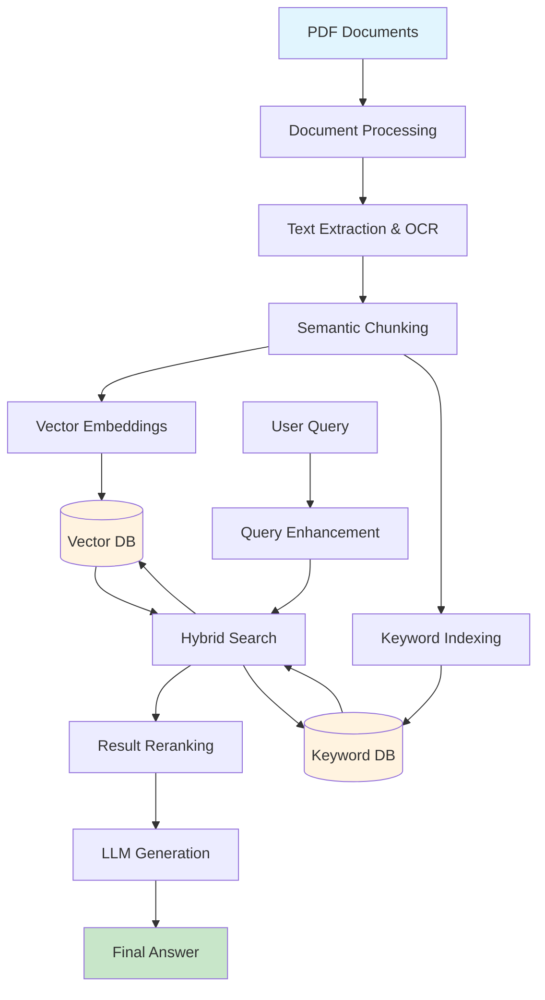
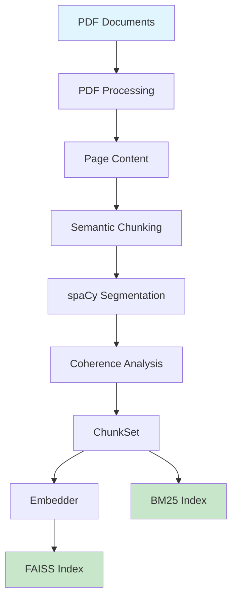
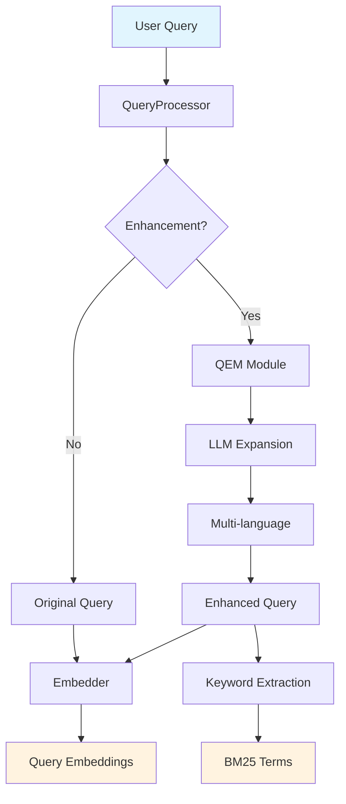
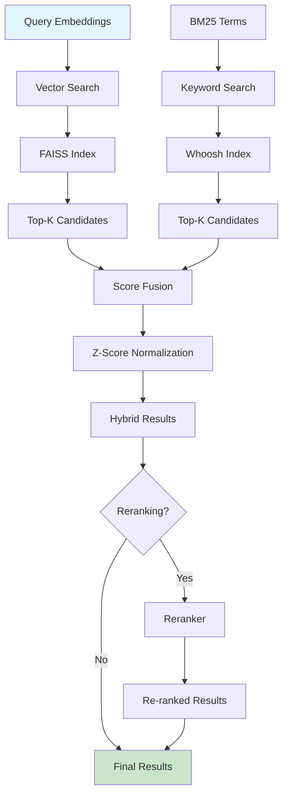
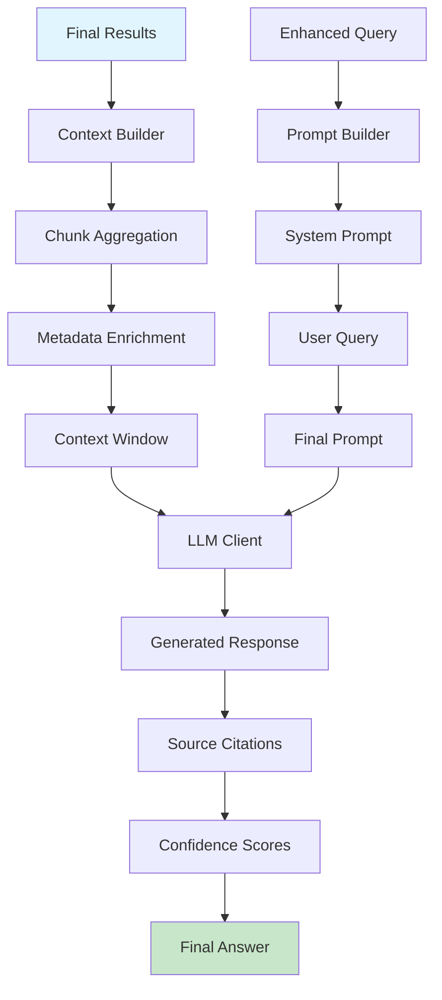

# RAGFlow — Advanced Retrieval-Augmented Generation System

[](https://www.python.org/downloads/)
[](LICENSE)

A comprehensive RAG system that transforms PDF documents into searchable knowledge bases using hybrid retrieval (semantic + keyword search), query enhancement, and intelligent reranking. Features modular architecture with multiple LLM and embedding providers.

## ✨ Key Features

- 🔍 **Hybrid Retrieval**: Combines vector similarity (FAISS) and keyword search (BM25) for superior accuracy
- 📄 **Advanced PDF Processing**: OCR integration, table extraction, multi-language support
- 🤖 **Multi-Provider Support**: Ollama, HuggingFace, Google Gemini, OpenAI
- 🔄 **Query Enhancement**: Intelligent query expansion using LLMs
- 📊 **Result Reranking**: Improved relevance through multiple reranking algorithms
- 🎨 **Modern UI**: Streamlit interface for document processing and chat
- 🏗️ **Modular Design**: Factory patterns, dependency injection, graceful degradation
- 🌐 **Multi-Language**: Support for 100+ languages including Vietnamese, English, Chinese

##  Quick Start

### System Requirements

- **Python**: 3.10+ (recommended)
- **Ollama**: Local LLM server (optional)
- **Memory**: 4GB+ RAM for document processing

### Installation

```bash
# Clone repository
git clone https://github.com/Flowerf19/RAG.git
cd RAG

# Create virtual environment
python -m venv .venv
.venv\Scripts\Activate.ps1  # Windows
source .venv/bin/activate   #linux

# Install dependencies
pip install -r requirements.txt

# Install language models
python -c "import spacy; spacy.cli.download('en_core_web_sm')"
python -c "import spacy; spacy.cli.download('vi_core_news_lg')"
```

### Basic Usage

1. **Start Ollama** (for local embeddings/LLMs):
```bash
ollama pull embeddinggemma:latest
ollama pull bge-m3:latest
```

2. **Process Documents**:
```bash
# Process all PDFs in data/pdf/
python -c "from pipeline.rag_pipeline import RAGPipeline; RAGPipeline().process_directory('data/pdf')"
```

3. **Launch Web Interface**:
```bash
streamlit run ui/app.py
```

##  Architecture Overview

### System Overview




### Core Components

- **PDFLoaders**: Advanced document processing with OCR and table extraction
- **Chunkers**: Intelligent text segmentation using spaCy and coherence analysis
- **Embedders**: Multi-provider embedding generation (Ollama, HuggingFace)
- **Pipeline**: Orchestrates the complete RAG workflow
- **Query Enhancement**: Expands queries for better retrieval
- **Reranking**: Improves result relevance using advanced algorithms
- **BM25**: Keyword-based search complementing vector search
- **LLM**: Multiple provider support for response generation
- **UI**: Streamlit interface for document processing and chat

### System Workflows

#### 📥 Ingest Workflow



#### 🔍 Search Workflow

##### Query Processing


##### Retrieval & Reranking


##### Response Generation

`

##  Key Differentiators

- **Hybrid Search**: Combines semantic and keyword-based retrieval for comprehensive coverage
- **Query Enhancement**: Uses LLMs to expand queries in multiple languages
- **Intelligent Reranking**: Multiple algorithms to improve result relevance
- **Production-Ready**: Error handling, caching, and performance optimization
- **Multi-Modal**: Supports text, tables, and images from PDFs
- **Local-First**: Works offline with local models and embeddings

##  Project Structure

```
RAG-2/
├── PDFLoaders/           # Advanced PDF processing with OCR
├── chunkers/             # Semantic text segmentation
├── embedders/            # Multi-provider embeddings
├── pipeline/             # Core RAG orchestration
├── query_enhancement/    # Query expansion module
├── reranking/            # Result reranking
├── BM25/                 # Keyword-based search
├── llm/                  # LLM provider integration
├── ui/                   # Streamlit web interface
│   └── dashboard/        # Evaluation dashboard
├── evaluation/           # Model evaluation system
│   ├── metrics/          # Database and logging
│   ├── evaluators/       # Auto-evaluation functions
│   └── backend_dashboard/# Dashboard API
├── data/                 # Indexes and processed data
├── config/               # Configuration files
├── prompts/              # System prompts
├── .github/              # GitHub workflows and templates
└── .streamlit/           # Streamlit configuration
```

##  Configuration

### Embedding Providers

| Provider | Model | Dimensions | Multilingual | Cost |
|----------|-------|------------|--------------|------|
| HuggingFace Local | BAAI/bge-m3 | 1024 | ✅ | Free |
| HuggingFace API | multilingual-e5-large | 1024 | ✅ | Free |
| Ollama | embeddinggemma | 768 | ✅ | Free |
| Ollama | bge-m3 | 1024 | ✅ | Free |

### Environment Setup

```bash
# HuggingFace API (optional)
export HF_TOKEN="your_token_here"

# Google Gemini (optional)
export GOOGLE_API_KEY="your_key_here"

# OpenAI (optional)
export OPENAI_API_KEY="your_key_here"
```

##  Use Cases

- **Document Q&A**: Ask questions about your PDF collection
- **Research Assistant**: Analyze academic papers and reports
- **Knowledge Base**: Build searchable company documentation
- **Legal Research**: Query legal documents with high precision
- **Technical Documentation**: Search API docs and manuals

##  Performance & Monitoring

### Benchmark Results

- **PDF Processing**: ~50 pages/minute with OCR enhancement
- **Vector Search**: < 10ms for 10K documents
- **BM25 Search**: < 5ms for keyword queries
- **Query Enhancement**: < 50ms per query
- **Reranking**: < 100ms for 20 candidates
- **Memory Usage**: ~2GB for 1K documents

### Troubleshooting

#### Common Issues

- **Ollama Connection**: Ensure Ollama is running on localhost:11434
- **PDF Processing**: Clear cache if processing fails
- **Memory Issues**: Reduce batch size or use smaller models
- **Embedding Mismatch**: Rebuild indexes when switching embedders

##  Contributing

### Development Setup

```bash
git clone https://github.com/Flowerf19/RAG.git
cd RAG
python -m venv .venv
.venv\Scripts\Activate.ps1
pip install -r requirements.txt
```

### Guidelines

- Write clear, documented code
- Add tests for new features
- Follow modular architecture patterns
- Update documentation for changes

##  Roadmap

### Phase 1 (Current) 
- Advanced PDF processing with OCR
- Hybrid retrieval (FAISS + BM25)
- Query enhancement and reranking
- Multi-LLM and embedder support
- Streamlit web interface

### Phase 2 (Future) 
- Cloud storage integration
- Real-time document streaming
- Advanced caching system
- REST API endpoints
- Performance analytics dashboard

##  License

MIT License - see [LICENSE](LICENSE) file for details.

##  Acknowledgments

Built with FAISS, Ollama, spaCy, Whoosh, Streamlit, PaddleOCR, and HuggingFace Transformers.

---

**RAGFlow**  Transforming documents into conversational knowledge bases.

##  Support

- **Developer**: Nguyễn Hoà (Hoaf.n.v@gmail.com)
- **Developer**: Lê Chiến (Bachien0987@gmail.com)
- **Documentation**: See individual module READMEs
