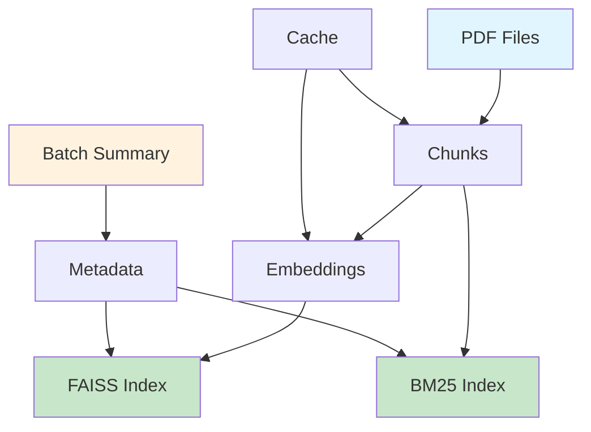

# Module Data — Data Management và Storage

Phiên bản: chi tiết thư mục `data/` cho hệ thống RAG (Retrieval-Augmented Generation).

Mô tả ngắn: thư mục `data/` chứa toàn bộ dữ liệu được tạo ra và quản lý bởi pipeline RAG, bao gồm PDF gốc, chunks đã chia, embeddings, FAISS indexes, metadata, và cache. Đây là data layer của hệ thống với cấu trúc phân cấp theo loại dữ liệu.

## Mục tiêu và phạm vi

- Tổ chức dữ liệu theo loại và timestamp
- Quản lý lifecycle của processed data
- Cache management để tối ưu performance
- Backup và recovery support

## Kiến trúc tổng quan

Thư mục `data/` gồm các phần chính:

- `pdf/` — PDF files gốc
- `chunks/` — Text chunks đã chia từ PDFs
- `embeddings/` — Vector embeddings (JSON format)
- `vectors/` — FAISS indexes và metadata maps
- `metadata/` — Document summaries và statistics
- `cache/` — Cache files để tránh re-processing
- `bm25_index/` — Whoosh BM25 indexes
- `batch_summary_*.json` — Batch processing reports

Luồng dữ liệu điển hình:

```text
PDF → Chunks → Embeddings → FAISS Index + Metadata → Search Results
```

## Cấu trúc thư mục chi tiết

### pdf/ — Raw PDF Files

- **Mục đích**: Lưu trữ PDF files gốc
- **Naming**: Original filename
- **Cleanup**: Không tự động xóa (manual cleanup)
- **Access**: Read-only sau khi processed

### chunks/ — Text Chunks

- **Mục đích**: Chunks đã chia từ PDFs
- **Format**: Plain text (.txt)
- **Naming**: `{filename}_chunks_{timestamp}.txt`
- **Content**: Mỗi chunk trên một dòng, separated by `---`

### embeddings/ — Vector Embeddings

- **Mục đích**: Raw embeddings trước khi vào FAISS
- **Format**: JSON array of vectors
- **Naming**: `{filename}_embeddings_{timestamp}.json`
- **Usage**: Debug và backup (thường không dùng trực tiếp)

### vectors/ — FAISS Indexes và Metadata

- **Mục đích**: Vector search indexes và metadata maps
- **Files**:
  - `{filename}_vectors_{timestamp}.faiss` — FAISS index (binary)
  - `{filename}_metadata_map_{timestamp}.pkl` — Chunk metadata (pickle)
- **Naming**: Timestamp-based để version control

### metadata/ — Document Summaries

- **Mục đích**: Statistics và info về processed documents
- **Format**: JSON với structured data
- **Naming**: `{filename}_summary_{timestamp}.json`
- **Content**: Document info, processing stats, file paths

### cache/ — Cache Management

- **Mục đích**: Tránh re-processing duplicate chunks
- **Files**:
  - `bm25_chunk_cache.json` — BM25 chunk hashes
  - `processed_chunks.json` — Vector processing cache
- **Cleanup**: Manual hoặc khi force re-processing

### bm25_index/ — BM25 Search Indexes

- **Mục đích**: Whoosh indexes cho keyword search
- **Structure**: Whoosh index directory
- **Naming**: Auto-generated by Whoosh
- **Status**: Có thể empty nếu chưa process BM25

## Data Lifecycle Management

### Creation Flow

```text
1. PDF uploaded → data/pdf/
2. PDF processed → chunks created → data/chunks/
3. Embeddings generated → data/embeddings/
4. FAISS index built → data/vectors/
5. Metadata saved → data/metadata/
6. Batch summary → data/batch_summary_*.json
```

### Cleanup Strategies

- **Automatic**: Cache files khi quá cũ
- **Manual**: Old versions khi disk space low
- **Backup**: Important files (vectors/, metadata/) trước khi xóa

### Version Control

- **Timestamp-based**: Mỗi processing run tạo version mới
- **Naming convention**: `{filename}_{datatype}_{timestamp}.{ext}`
- **Retention**: Keep last N versions, archive older ones

## File Formats và Data Structures

### Chunk Files (.txt)

```text
Chunk content line 1
Chunk content line 2
---
Next chunk content...
---
```

### Embedding Files (.json)

```json
[
  [0.123, 0.456, 0.789, ...],  // Vector 1 (768-dim)
  [0.234, 0.567, 0.890, ...],  // Vector 2
  ...
]
```

### Metadata Summary (.json)

```json
{
  "document": {
    "file_name": "document.pdf",
    "file_path": "data/pdf/document.pdf",
    "pages": 10,
    "processed_date": "2025-10-21T10:32:46.420701"
  },
  "processing": {
    "chunks": 47,
    "tokens": 8125,
    "strategy": "hybrid",
    "embeddings": 47,
    "dimension": 768,
    "model": "embeddinggemma:latest"
  },
  "files": {
    "faiss_index": "data/vectors/document_vectors_20251021.faiss",
    "metadata_map": "data/vectors/document_metadata_map_20251021.pkl"
  }
}
```

### Batch Summary (.json)

```json
{
  "timestamp": "2025-10-21T10:36:32.762833",
  "total_files": 3,
  "successful": 3,
  "failed": 0,
  "total_chunks": 133,
  "total_embeddings": 133,
  "results": [
    {
      "success": true,
      "file_name": "doc1.pdf",
      "pages": 9,
      "chunks": 47,
      "embeddings": 47,
      "files": {
        "chunks": "data/chunks/doc1_chunks_20251021.txt",
        "embeddings": "data/embeddings/doc1_embeddings_20251021.json",
        "faiss_index": "data/vectors/doc1_vectors_20251021.faiss",
        "metadata_map": "data/vectors/doc1_metadata_map_20251021.pkl",
        "summary": "data/metadata/doc1_summary_20251021.json"
      }
    }
  ]
}
```

### Cache Files (.json)

```json
{
  "chunk_doc1.pdf_0_hash": {
    "content_hash": "25bb73c42666d30d4cbb63fb3a997333",
    "metadata": {
      "doc_id": "doc1.pdf",
      "chunk_id": "chunk_doc1.pdf_0_hash",
      "page_numbers": [1, 2],
      "section_title": "Introduction"
    }
  }
}
```

## Integration với Pipeline

### Pipeline Data Flow

```python
# Trong RAGPipeline.process_pdf()
pdf_path = self._save_pdf_to_data(pdf_doc)
chunk_set = self.chunker.chunk(pdf_doc)
self._save_chunks_to_data(chunk_set)
embeddings = self.embedder.embed_chunks(chunk_set)
self._save_embeddings_to_data(embeddings)
faiss_index = self.vector_store.create_index(embeddings)
self._save_vector_data(faiss_index, metadata_map)
self._save_metadata_summary(pdf_doc, processing_stats)
```

### Search Integration

```python
# Vector search
results = pipeline.search_similar(
    faiss_file=Path("data/vectors/doc_vectors_20251021.faiss"),
    metadata_map_file=Path("data/vectors/doc_metadata_map_20251021.pkl"),
    query_text="search query",
    top_k=5
)

# BM25 search
bm25_results = pipeline.search_bm25("query", top_k=5)
```

## Disk Space Management

### Storage Estimation

- **PDFs**: ~1MB per document
- **Chunks**: ~10-50KB per document
- **Embeddings**: ~300KB per document (768-dim × 4 bytes × chunks)
- **FAISS Index**: ~100KB per document
- **Metadata**: ~1KB per document

### Cleanup Commands

```powershell
# Remove old versions (keep last 3)
Get-ChildItem "data\vectors\*" | Sort-Object LastWriteTime -Descending | Select-Object -Skip 3 | Remove-Item

# Clear all cache
Remove-Item "data\cache\*.json"

# Force re-processing
Remove-Item "data\cache\processed_chunks.json"
Remove-Item "data\vectors\*"
Remove-Item "data\embeddings\*"
```

## Backup và Recovery

### Critical Files

- `data/vectors/*.faiss` — FAISS indexes (không thể recreate dễ dàng)
- `data/vectors/*.pkl` — Metadata maps
- `data/metadata/*.json` — Processing summaries
- `data/pdf/*.pdf` — Source files

### Backup Strategy

```powershell
# Backup command
Compress-Archive -Path "data\vectors", "data\metadata", "data\pdf" -DestinationPath "backup_$(Get-Date -Format 'yyyyMMdd_HHmmss').zip"
```

## Monitoring và Debugging

### Data Integrity Checks

```python
# Verify FAISS index integrity
from pipeline.vector_store import VectorStore
store = VectorStore(Path("data/vectors"))
index = store.load_index("doc_vectors_20251021.faiss")
print(f"Index loaded: {index.ntotal} vectors")

# Check metadata consistency
import pickle
with open("data/vectors/doc_metadata_map_20251021.pkl", "rb") as f:
    metadata = pickle.load(f)
print(f"Metadata entries: {len(metadata)}")
```

### Performance Monitoring

- **File sizes**: Monitor disk usage trends
- **Processing times**: Track in batch summaries
- **Cache hit rates**: Monitor re-processing frequency

## Troubleshooting

### Common Issues

- **Missing FAISS files**: Re-run pipeline cho document đó
- **Corrupted cache**: Delete cache files và re-process
- **Out of disk space**: Cleanup old versions
- **Inconsistent metadata**: Check batch summary cho errors

### Recovery Procedures

1. **Lost FAISS index**: Re-run `pipeline.process_pdf()` cho document
2. **Corrupted metadata**: Re-generate từ batch summary
3. **Missing chunks**: Re-run chunking step
4. **Cache issues**: Delete cache và re-process

## Sơ đồ kiến trúc dữ liệu



ASCII fallback:

```text
Data Architecture:
├── Source: PDF files
├── Processing: Chunks → Embeddings
├── Search: FAISS (vectors) + BM25 (keywords)
├── Metadata: Summaries + statistics
├── Cache: Processing optimization
└── Reports: Batch processing logs
```

## Best Practices

- **Version Control**: Luôn giữ timestamp trong filenames
- **Backup First**: Backup trước khi cleanup
- **Monitor Space**: Track disk usage regularly
- **Validate Integrity**: Check file consistency sau processing
- **Document Changes**: Update README khi thay đổi structure

## Migration và Upgrades

### Version Compatibility

- **FAISS 1.x**: Compatible với current implementation
- **JSON format**: Standard, no migration needed
- **Pickle format**: Python version dependent

### Future Extensions

- **Compression**: LZ4 cho large embedding files
- **Database**: Migrate metadata từ JSON sang SQLite
- **Cloud Storage**: Support S3/GCS cho large datasets
- **Incremental Updates**: Partial re-processing support
