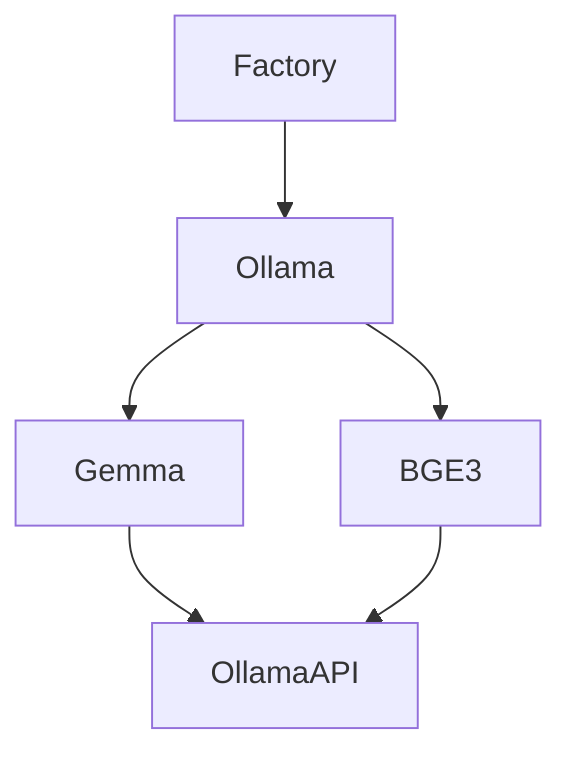

# Module `embedders` — Tạo embedding vectors (Ollama & HuggingFace providers)

Mục tiêu: thư mục `embedders/` cung cấp lớp trừu tượng và các implement cụ thể để tạo embedding vectors từ văn bản. Thiết kế theo nguyên tắc Single Responsibility: mỗi lớp có trách nhiệm rõ ràng (profile/config, factory, base provider, provider cụ thể).

README này mô tả kiến trúc, API công khai, các lớp/factory có sẵn, ví dụ sử dụng, kiểm thử và các lưu ý vận hành (Ollama server, HuggingFace API).

## Nội dung thư mục (tóm tắt)

- `i_embedder.py` — interface `IEmbedder` (embed, embed_batch, test_connection, dimension).
- `base_embedder.py` (providers/) — `BaseEmbedder` cung cấp hành vi chung (validation, embed_batch default).
- `embedder_factory.py` — `EmbedderFactory` để khởi tạo embedders theo `EmbeddingProfile` / loại.
- `embedder_type.py` — enum `EmbedderType` (hiện có `OLLAMA`, `HUGGINGFACE`).
- `model/embedding_profile.py` — `EmbeddingProfile` dataclass chứa cấu hình (model_id, provider, max_tokens, dimension, normalize).
- `providers/` — provider implementations:
  - `ollama_embedder.py` — generic Ollama provider wrapper (`OllamaEmbedder`).
  - `ollama/` — Ollama-specific model wrappers:
    - `gemma_embedder.py` — Gemma embedding config (768-dim)
    - `bge3_embedder.py` — BGE-M3 embedding config (1024-dim)
    - `base_ollama_embedder.py` — base class for Ollama-specific embedders
  - `huggingface/` — HuggingFace-specific embedders:
    - `hf_api_embedder.py` — HF API embedder (BAAI/bge-small-en-v1.5, 384-dim)
    - `hf_local_embedder.py` — HF Local embedder using transformers
    - `base_huggingface_embedder.py` — base class for HF embedders
    - `token_manager.py` — HF API token management

## Contract (inputs / outputs / error modes)

- Input: text (str) hoặc list[str] cho batch.
- Output: List[float] (vector) cho `embed`, List[List[float]] cho `embed_batch`.
- Properties: `dimension` (số chiều embedding).
- Error modes: network/HTTP errors when connecting to Ollama; invalid profile errors raised by `BaseEmbedder`.

## Thiết kế & hành vi từng thành phần

### `IEmbedder` (`i_embedder.py`)

- Đây là interface tối thiểu mọi embedder phải implement:
  - `dimension` (property): trả về kích thước vector.
  - `embed(text: str) -> List[float]`.
  - `embed_batch(texts: List[str]) -> List[List[float]]`.
  - `test_connection() -> bool`: kiểm tra server/provider reachable.

Việc implement theo interface giúp pipeline có thể thay provider mà không đổi code khác.

### `EmbeddingProfile` (`model/embedding_profile.py`)

- Dataclass đơn giản giữ các tham số thực sự dùng bởi provider: `model_id`, `provider`, `max_tokens`, `dimension`, `normalize`.
- Lưu ý: nhiều embedder cụ thể (Gemma/BGE) giữ cấu hình mặc định ở class-level constants — factory hoặc `create_default()` dùng các giá trị này.

### `BaseEmbedder` (`providers/base_embedder.py`)

- Cung cấp validation cho `EmbeddingProfile` và implement `embed_batch` mặc định bằng cách gọi `embed` lần lượt.
- `dimension` mặc định lấy từ `profile.dimension` hoặc fallback 768.

### `OllamaEmbedder` (`providers/ollama_embedder.py`)

- Generic wrapper cho Ollama server (`/api/embeddings` endpoint). Thực hiện:
  - `create_default()` để build `EmbeddingProfile` mặc định (nomic embed)
  - `_generate_embedding(text)` gửi POST tới `/api/embeddings`
  - `test_connection()`, `is_available()`, `get_available_models()` helper
  - `switch_model(model_name)` để đổi profile.model_id nếu model có sẵn

Lưu ý: Ollama server URL mặc định `http://localhost:11434` — có thể cấu hình qua factory.

### Model-specific embedders (Gemma, BGE-M3)

- `GemmaEmbedder` và `BGE3Embedder` là thin wrappers trên `BaseOllamaEmbedder` (ở `providers/ollama/`).
- Mỗi lớp định nghĩa `MODEL_ID`, `DIMENSION`, `MAX_TOKENS` và `create_default()` để khởi tạo profile tương ứng.
- Họ cung cấp phương thức `embed(text)` và `embed_single(req)` (hữu ích nếu dự án dùng `EmbedRequest` model).

## Ví dụ sử dụng (Python)

```python
from embedders.embedder_factory import EmbedderFactory

factory = EmbedderFactory()

# === Ollama Embedders ===

# Tạo Gemma embedder (Ollama)
gemma = factory.create_gemma(base_url="http://localhost:11434")
vec = gemma.embed("Hello world")
print(len(vec), gemma.dimension)  # 768

# Tạo BGE-M3 embedder
bge = factory.create_bge_m3(base_url="http://localhost:11434")
batch = bge.embed_batch(["Hello", "Another text"])
print(len(batch), len(batch[0]))  # 1024

# === HuggingFace Embedders ===

# Tạo HF API embedder (requires HF_TOKEN)
hf_api = factory.create_huggingface_api()
vec = hf_api.embed("Hello world")
print(len(vec), hf_api.dimension)  # 384

# Tạo HF Local embedder (requires transformers)
hf_local = factory.create_huggingface_local(device="cpu")
vec = hf_local.embed("Hello world")
print(len(vec), hf_local.dimension)  # 384

# Test connection
print('gemma ok', gemma.test_connection())
print('hf_api ok', hf_api.test_connection())
```

PowerShell quick-run (pipeline):

```powershell
python run_pipeline.py
```

## Mermaid: kiến trúc cao cấp (parser-friendly) + ASCII fallback



ASCII fallback:

- `EmbedderFactory` tạo instances (Gemma/BGE3) hoặc generic `OllamaEmbedder`.
- Các embedder gọi Ollama API `/api/embeddings` để lấy vectors.
- `BaseEmbedder` cung cấp `embed_batch` mặc định để fallback khi provider không tối ưu batch API.

## Testing & Validation

- Unit-test suggestions:
  - mock `requests.post`/`requests.get` để kiểm tra `_generate_embedding()` behavior và error handling.
  - test `EmbedderFactory.create_gemma()` và `create_bge_m3()` return đúng class và `dimension`.
  - test `BaseEmbedder.embed_batch` calls `embed` for each item.

- Quick manual test: start Ollama server and run the example above.

## Operational notes

### Ollama Embedders
- Ollama server must be reachable at the configured `base_url` (default: `http://localhost:11434`). Use `ollama list` locally to verify pulled models.
- Required models used by defaults: `embeddinggemma:latest`, `bge-m3:latest` — pull them to local Ollama if needed.

### HuggingFace Embedders
- **API Mode** (`HuggingFaceApiEmbedder`): 
  - Requires HF API token: set `HF_TOKEN` or `HUGGINGFACE_TOKEN` environment variable, or store in `.streamlit/secrets.toml`
  - Subject to rate limits (free tier: ~30k tokens/month)
  - Default model: `BAAI/bge-small-en-v1.5` (384-dim)
  
- **Local Mode** (`HuggingFaceLocalEmbedder`):
  - Requires `transformers` and `torch` installed: `pip install transformers torch`
  - Downloads model on first use (~100MB for BGE-small)
  - No rate limits, runs entirely offline
  - Supports GPU acceleration with `device="cuda"`

## Architecture Pattern

Embedders follow a consistent pattern inspired by Ollama structure:

```
providers/
├── ollama/
│   ├── base_ollama_embedder.py      # Base class
│   ├── gemma_embedder.py            # Specific implementation
│   └── bge3_embedder.py             # Specific implementation
├── huggingface/
│   ├── base_huggingface_embedder.py # Base class
│   ├── hf_api_embedder.py           # API implementation
│   ├── hf_local_embedder.py         # Local implementation
│   └── token_manager.py             # Utility
```

Each provider family:
1. **Base class** (`BaseXxxEmbedder`): defines common behavior, class-level constants, abstract methods
2. **Specific implementations**: override constants, implement `_generate_embedding()`, provide `create_default()`
3. **Factory methods**: `EmbedderFactory.create_xxx()` for easy instantiation

## Contribution

- Khi thêm provider mới (OpenAI, Anthropic): follow the pattern above:
  1. Create `providers/newprovider/` directory
  2. Implement `base_newprovider_embedder.py` extending `BaseEmbedder`
  3. Create specific implementations (e.g., `gpt4_embedder.py`)
  4. Add factory methods to `EmbedderFactory`
  5. Update `embedder_type.py` enum if needed
  6. Document in README with examples