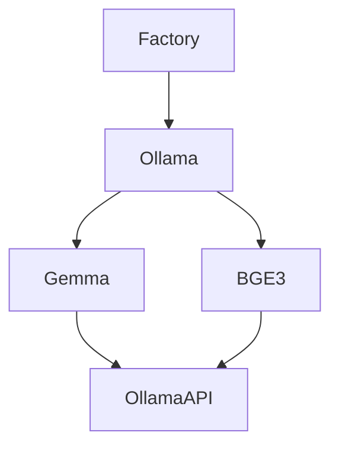

# Embedders Module — Text to Vector Conversion (Ollama & HuggingFace providers)

[](https://www.python.org/downloads/)
[](../../LICENSE)

The embedders module provides abstraction layers and concrete implementations for converting text into embedding vectors. Designed following Single Responsibility principle: each class has clear responsibilities (profile/config, factory, base provider, specific provider).

This README describes the architecture, public API, available classes/factories, usage examples, testing, and operational notes (Ollama server, HuggingFace API).

## ✨ Key Features

- 🔄 **Provider Abstraction**: Unified interface for different embedding providers
- 🏭 **Factory Pattern**: Easy instantiation of embedders by type and configuration
- 📏 **Dimension Management**: Consistent vector dimensions across providers
- 🔗 **Batch Processing**: Efficient processing of multiple texts
- 🧪 **Connection Testing**: Built-in connectivity validation for providers
- ⚙️ **Flexible Configuration**: Customizable models, tokens, and normalization settings

## 🚀 Quick Start

### Install Dependencies

```bash
# Install core dependencies
pip install -r requirements.txt

# For HuggingFace local embedder
pip install transformers torch
```

### Basic Usage

The module provides unified text-to-vector conversion with support for multiple providers and automatic configuration management.

## 📁 Directory Contents

- `i_embedder.py` — `IEmbedder` interface (embed, embed_batch, test_connection, dimension)
- `embedder_factory.py` — `EmbedderFactory` for creating embedders by profile/type
- `embedder_type.py` — `EmbedderType` enum (OLLAMA, HUGGINGFACE)
- `model/embedding_profile.py` — `EmbeddingProfile` dataclass with configuration
- `providers/` — Provider implementations:
  - `ollama_embedder.py` — Generic Ollama provider wrapper
  - `ollama/` — Ollama-specific implementations:
    - `gemma_embedder.py` — Gemma embedding (768-dim)
    - `bge3_embedder.py` — BGE-M3 embedding (1024-dim)
    - `base_ollama_embedder.py` — Base class for Ollama embedders
  - `huggingface/` — HuggingFace implementations:
    - `hf_api_embedder.py` — HF API embedder (384-dim)
    - `hf_local_embedder.py` — Local HF embedder
    - `base_huggingface_embedder.py` — Base class for HF embedders
    - `token_manager.py` — HF API token management

## 🔌 API Contract

### Inputs/Outputs
- **Input**: Single text string or list of strings for batch processing
- **Output**: List of floats (vector) for single text, list of lists for batch
- **Properties**: `dimension` returns vector size
- **Error Handling**: Network/HTTP errors for remote providers, validation errors for invalid configurations

## 🔧 Component Design & Behavior

### IEmbedder Interface (i_embedder.py)

The minimal interface that all embedders must implement:
- `dimension` property returns vector size
- `embed(text: str) -> List[float]` converts single text to vector
- `embed_batch(texts: List[str]) -> List[List[float]]` processes multiple texts
- `test_connection() -> bool` validates provider connectivity

Interface implementation allows the pipeline to switch providers without changing other code.

### EmbeddingProfile (model/embedding_profile.py)

Simple dataclass holding provider parameters: model_id, provider type, max_tokens, dimension, and normalization settings.
Note: Specific embedders (Gemma/BGE) store default configurations as class constants that factory methods use.

### BaseEmbedder (providers/base_embedder.py)

Provides common validation for EmbeddingProfile and default embed_batch implementation that calls embed sequentially.
Dimension defaults to profile.dimension or falls back to 768.

### OllamaEmbedder (providers/ollama_embedder.py)

Generic wrapper for Ollama server using the /api/embeddings endpoint. Provides:
- Default profile creation for standard models
- HTTP POST requests to generate embeddings
- Connection testing and model availability checks
- Model switching capabilities

Default Ollama server URL is http://localhost:11434, configurable through factory.

### Model-Specific Embedders (Gemma, BGE-M3)

GemmaEmbedder and BGE3Embedder are lightweight wrappers around BaseOllamaEmbedder.
Each defines MODEL_ID, DIMENSION, MAX_TOKENS constants and provides create_default() for profile initialization.
They offer embed() methods and embed_single() for projects using EmbedRequest models.

## 💡 Usage Examples

### Basic Usage

```python
from embedders.embedder_factory import EmbedderFactory

factory = EmbedderFactory()

# Create Ollama-based embedders
gemma = factory.create_gemma(base_url="http://localhost:11434")
vector = gemma.embed("Hello world")

bge = factory.create_bge_m3(base_url="http://localhost:11434")
batch_vectors = bge.embed_batch(["Hello", "Another text"])

# Create HuggingFace embedders
hf_api = factory.create_huggingface_api()
vector = hf_api.embed("Hello world")

hf_local = factory.create_huggingface_local(device="cpu")
vector = hf_local.embed("Hello world")

# Test connections
print('Connection OK:', gemma.test_connection())
```

### Integration with Pipeline

The embedders integrate seamlessly with the RAG pipeline for automatic text vectorization.

## 🏗️ Architecture Overview



ASCII fallback:

- `EmbedderFactory` creates instances (Gemma/BGE3) or generic `OllamaEmbedder`
- Embedders call Ollama API `/api/embeddings` to get vectors
- `BaseEmbedder` provides default `embed_batch` as fallback when provider doesn't optimize batch API

## Testing & Validation

## 🧪 Testing & Validation

### Unit Tests
Test individual embedder components, factory methods, and connection validation.

### Integration Tests
Test complete workflows with different providers to verify embedding quality and performance.

### Manual Testing
Start provider services and run basic embedding operations to validate functionality.

## ⚠️ Operational Notes

### Ollama Embedders
- Ollama server must be running at configured base_url (default: http://localhost:11434)
- Required models: embeddinggemma:latest, bge-m3:latest
- Use local Ollama commands to verify and pull models

### HuggingFace Embedders
- **API Mode**: Requires HF token, subject to rate limits, default model BAAI/bge-small-en-v1.5 (384-dim)
- **Local Mode**: Requires transformers/torch, downloads models on first use, supports GPU acceleration

## 🏗️ Architecture Pattern

Embedders follow a consistent pattern with provider families:

```
providers/
├── ollama/
│   ├── base_ollama_embedder.py      # Base class
│   ├── gemma_embedder.py            # Specific implementation
│   └── bge3_embedder.py             # Specific implementation
├── huggingface/
│   ├── base_huggingface_embedder.py # Base class
│   ├── hf_api_embedder.py           # API implementation
│   ├── hf_local_embedder.py         # Local implementation
│   └── token_manager.py             # Utility
```

Each provider family includes:
1. **Base class**: Common behavior, constants, abstract methods
2. **Specific implementations**: Override constants, implement embedding generation
3. **Factory methods**: Easy instantiation through EmbedderFactory

## 🤝 Contributing

### Adding New Providers
When adding new providers (OpenAI, Anthropic), follow this pattern:
1. Create `providers/newprovider/` directory
2. Implement `base_newprovider_embedder.py` extending `BaseEmbedder`
3. Create specific implementations with model configurations
4. Add factory methods to `EmbedderFactory`
5. Update `embedder_type.py` enum if needed
6. Document in README with usage examples