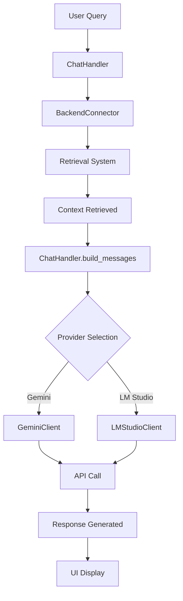
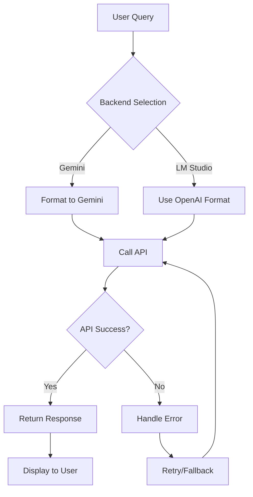

# LLM Module — Large Language Model Integration

Version: OOP-refactored LLM module for RAG system with factory pattern and multiple providers.

**Short description**: The `llm/` directory contains components for integrating with Large Language Models (LLMs), including clients for various APIs (Gemini, LM Studio), chat interfaces, and message handling logic. This module connects the retrieval system with LLMs to generate intelligent responses based on context.

## Objectives and Scope

- **Single Responsibility**: Handle LLM communication and chat UI
- **Multiple LLM Backends**: Support Gemini API and LM Studio local servers
- **RAG Workflow**: Integrate with context retrieval for augmented generation
- **Configuration Management**: Centralized config handling and message formatting

## High-Level Architecture

The `llm/` module consists of:

- **`client_factory.py`** — Factory pattern for creating LLM clients
- **`base_client.py`** — Abstract base class defining the LLM client interface
- **`gemini_client.py`** — Google Gemini API implementation
- **`lmstudio_client.py`** — LM Studio local server implementation
- **`chat_handler.py`** — Message formatting and conversation management
- **`config_loader.py`** — YAML configuration management
- **`chat_styles.css`** — CSS styling for chat interfaces

**Data Flow**:
```
User Query → UI (Streamlit)
  → chat_handler.py (format messages)
  → retrieval system (get context)
  → LLM Client (Gemini/LM Studio)
  → format response → display to user
```

## Key Components (Detailed)

### `BaseLLMClient` (`base_client.py`)

Abstract base class defining the contract for all LLM providers:

- **`generate(messages, **kwargs)`** — Core method for text generation
- **`is_available()`** — Check service availability
- **Configuration management** — Model settings, temperature, max_tokens
- **Polymorphism support** — All clients implement the same interface

### `LLMClientFactory` (`client_factory.py`)

Factory pattern for easy client instantiation:

- **`create(provider)`** — Create client by enum
- **`create_gemini()`** — Pre-configured Gemini client
- **`create_lmstudio()`** — Pre-configured LM Studio client
- **`create_from_string()`** — Create from string name (UI-friendly)

### `GeminiClient` (`gemini_client.py`)

Google Gemini API implementation:

- **Format conversion**: OpenAI → Gemini message format
- **Streaming support**: Real-time response generation
- **Error handling**: API failures, rate limits, authentication
- **Configuration**: API key, model selection, generation parameters

### `LMStudioClient` (`lmstudio_client.py`)

LM Studio local server implementation:

- **OpenAI compatibility**: Uses OpenAI client library
- **Local inference**: No API keys required
- **Parameter tuning**: Temperature, top_p, max_tokens
- **Model management**: Dynamic model switching

### `ChatHandler` (`chat_handler.py`)

Message processing and formatting:

- **`build_messages()`** — Create conversation with system prompts
- **`load_system_prompt()`** — Load prompts from files
- **`format_system_prompt()`** — Inject context into templates
- **History management** — Conversation state tracking

### `ConfigLoader` (`config_loader.py`)

Centralized configuration management:

- **YAML loading**: Parse configuration files
- **Environment resolution**: API keys, endpoints, paths
- **Provider settings**: Gemini and LM Studio configurations
- **Path management**: File and directory resolution

## Usage Examples

### Python (OOP Style)

```python
from llm.client_factory import LLMClientFactory
from llm.chat_handler import ChatHandler

# Create LLM client
client = LLMClientFactory.create_gemini(temperature=0.7)

# Build messages with RAG context
handler = ChatHandler()
messages = handler.build_messages(
    user_query="What is RAG?",
    context="RAG stands for Retrieval-Augmented Generation..."
)

# Generate response
response = client.generate(messages, max_tokens=512)
print(response)
```

### Factory Methods

```python
# Gemini client
gemini = LLMClientFactory.create_gemini(
    api_key="your-key",
    model="gemini-1.5-pro",
    temperature=0.8
)

# LM Studio client
lmstudio = LLMClientFactory.create_lmstudio(
    base_url="http://localhost:1234/v1",
    model="local-model-name"
)

# Check availability
if gemini.is_available():
    response = gemini.generate([{"role": "user", "content": "Hello"}])
```

### Integration with RAG Pipeline

```python
from pipeline.backend_connector import BackendConnector
from llm.client_factory import LLMClientFactory

# Get retrieval context
connector = BackendConnector()
context = connector.fetch_retrieval("user query")

# Create client and generate
client = LLMClientFactory.create_from_string("gemini")
messages = ChatHandler().build_messages("user query", context)
response = client.generate(messages)
```

## API Contracts

### `BaseLLMClient.generate()`
- **Input**: `messages` (List[Dict[str, str]]) - OpenAI format
- **Parameters**: `temperature`, `max_tokens`, `**kwargs`
- **Output**: `str` - Generated response text
- **Raises**: `Exception` on API failures

### `LLMClientFactory.create_*()`
- **Input**: Provider-specific configuration
- **Output**: Configured `BaseLLMClient` instance
- **Factory Methods**: `create_gemini()`, `create_lmstudio()`, `create_from_string()`

### `ChatHandler.build_messages()`
- **Input**: `user_query` (str), `context` (str)
- **Output**: `List[Dict[str, str]]` - Formatted messages
- **Includes**: System prompt + context injection

## Mermaid: LLM Integration Flow



ASCII fallback:
```
LLM Flow:
1) User query → ChatHandler
2) Get context from retrieval
3) Build messages with context
4) Select provider (Gemini/LM Studio)
5) Call LLM API
6) Return formatted response
7) Display in UI
```

## Testing & Validation

### Unit Tests
```python
# Test client creation
client = LLMClientFactory.create_gemini()
assert client.is_available()

# Test message building
messages = ChatHandler().build_messages("query", "context")
assert len(messages) >= 2  # system + user

# Mock API responses for testing
```

### Integration Tests
```python
# Test full RAG flow
context = connector.fetch_retrieval("test query")
messages = handler.build_messages("test query", context)
response = client.generate(messages)
assert isinstance(response, str)
```

## Operational Notes

### Gemini Provider
- **API Key Required**: Set `GEMINI_API_KEY` environment variable
- **Rate Limits**: Free tier has token limits (~30k/month)
- **Models**: `gemini-1.5-pro`, `gemini-1.5-flash`
- **Cost**: Pay-per-token for high usage

### LM Studio Provider
- **Local Server**: Must run LM Studio locally on port 1234
- **No API Key**: Uses local models only
- **Models**: Any GGUF model loaded in LM Studio
- **Performance**: Depends on local hardware

### Configuration
- **Primary Config**: `config/app.yaml`
- **Environment Variables**: Override YAML settings
- **Secrets**: Use `.streamlit/secrets.toml` for API keys

## Architecture Pattern

**Factory Pattern Implementation**:
```
BaseLLMClient (Abstract)
├── GeminiClient (Concrete)
└── LMStudioClient (Concrete)

LLMClientFactory
├── create(provider)
├── create_gemini()
├── create_lmstudio()
└── create_from_string()
```

**Benefits**:
- **Polymorphism**: All clients implement same interface
- **Extensibility**: Easy to add new providers
- **Configuration**: Centralized client creation
- **Testing**: Mock clients for unit tests

## Migration from Legacy Code

### Old Way (Deprecated)
```python
# ❌ Don't use
from llm.LLM_API import call_gemini
response = call_gemini(messages)
```

### New Way (OOP)
```python
# ✅ Use this
from llm.client_factory import LLMClientFactory
client = LLMClientFactory.create_gemini()
response = client.generate(messages)
```

**Breaking Changes**:
- `LLM_API.py` → `gemini_client.py`
- `LLM_LOCAL.py` → `lmstudio_client.py`
- `LLM_FE.py` → `ui/app.py`
- Function calls → Object methods

## Contribution Guidelines

- **OOP Principles**: Use inheritance, polymorphism, encapsulation
- **Factory Pattern**: Always use `LLMClientFactory` for client creation
- **Error Handling**: Implement proper exception handling in all clients
- **Documentation**: Add docstrings for all public methods
- **Testing**: Write unit tests for new providers
- **Configuration**: Use `config_loader.py` for settings management

## Reference Links

- **Pipeline Integration**: `pipeline/backend_connector.py`
- **UI Components**: `ui/app.py` and `ui/components/`
- **System Prompts**: `prompts/rag_system_prompt.txt`
- **Configuration**: `config/app.yaml`

## Các module chính (chi tiết)

### LLM_FE.py

- Mục đích: giao diện Streamlit cho chatbot RAG
- Tính năng:
  - Chat interface với history
  - Backend selection (Gemini/LM Studio)
  - Integration với retrieval system
  - File upload và processing
  - Settings management

### LLM_API.py

- Mục đích: client cho Google Gemini API
- Tính năng:
  - Convert OpenAI format → Gemini format
  - Handle API calls với error handling
  - Streaming responses
  - Configuration management

### LLM_LOCAL.py

- Mục đích: client cho LM Studio (local LLM server)
- Tính năng:
  - OpenAI-compatible API calls
  - Local model management
  - Parameter tuning (temperature, top_p, max_tokens)

### chat_handler.py

- Mục đích: xử lý logic chat và message formatting
- Tính năng:
  - Load system prompts từ files
  - Format messages với context
  - Build conversation history
  - Template management

### config_loader.py

- Mục đích: centralized configuration management
- Tính năng:
  - Load YAML configs
  - Resolve API keys và endpoints
  - Path management
  - Environment variable handling

## Hành vi "Auto-quét" (Auto-scan) và tích hợp với pipeline

Module `llm/` tích hợp với pipeline thông qua:

- **Retrieval Integration**: `LLM_FE.py` gọi `pipeline.backend_connector.fetch_retrieval()`
- **Config Sharing**: Sử dụng chung `config/app.yaml`
- **Prompt Templates**: Load từ `prompts/rag_system_prompt.txt`

Ví dụ run chat interface:

```powershell
# Chạy Streamlit chat UI
streamlit run llm/LLM_FE.py
```

Hoặc sử dụng trực tiếp LLM clients:

```python
from llm.LLM_API import call_gemini
from llm.chat_handler import build_messages

# Build messages với context
messages = build_messages("user query", "retrieved context")

# Call Gemini
response = call_gemini(messages, temperature=0.7)
```

## Contract (tóm tắt API / dữ liệu)

- Input cho `call_gemini()`: messages (List[Dict]), parameters (temperature, etc.)
- Output: response string từ Gemini API
- Input cho `call_lmstudio()`: messages, model, temperature, top_p, max_tokens
- Output: response string từ LM Studio

## Edge cases và cách xử lý

- API key missing: config_loader raise exception
- Network errors: retry logic với exponential backoff
- Invalid responses: fallback handling
- Context too long: truncation logic

## Logging & Debugging

- LLM clients ghi log API calls và errors
- UI logs user interactions và retrieval calls
- Debug mode cho verbose output

## Kiểm thử

```powershell
# Test LLM clients
python -m pytest test/llm/ -v
```

## Hướng dẫn đóng góp (contributors)

- Viết comment và docstring bằng tiếng Việt
- Handle both direct execution và module import patterns
- Use config_loader thay vì hardcode configs
- Add proper error handling cho API calls

## Tài liệu tham chiếu và liên kết

- Pipeline: `pipeline/backend_connector.py` — retrieval integration
- Prompts: `prompts/rag_system_prompt.txt` — system prompts
- Config: `config/app.yaml` — LLM settings

## Ghi chú triển khai / Assumptions

- Gemini API key required trong environment
- LM Studio server phải chạy locally
- Streamlit version compatible với features used

## Chi tiết kỹ thuật theo file (tham chiếu mã nguồn)

### `llm/LLM_FE.py` — Streamlit Chat Interface

- Main function: `main()` — setup Streamlit UI
- Features:
  - `st.sidebar` — backend selection và settings
  - Chat history management
  - File upload processing
  - Real-time streaming responses

- Integration points:
  - `fetch_retrieval()` — get context từ pipeline
  - `call_gemini()` / `call_lmstudio()` — LLM calls
  - `build_messages()` — message formatting

### `llm/LLM_API.py` — Gemini Client

- Core function: `call_gemini(messages, **kwargs)`
- Format conversion: `convert_to_gemini_format()` — OpenAI → Gemini
- Error handling: try/catch với detailed logging

### `llm/LLM_LOCAL.py` — LM Studio Client

- Core function: `call_lmstudio(messages, model, **kwargs)`
- Client creation: `get_client()` — OpenAI client instance
- Direct OpenAI format support (no conversion needed)

### `llm/chat_handler.py` — Message Handler

- `load_system_prompt()` — load từ file
- `format_system_prompt(context)` — inject context
- `build_messages(user_query, context)` — create message list

### `llm/config_loader.py` — Configuration Manager

- `_load_yaml()` — YAML parsing
- `resolve_gemini_settings()` — Gemini API config
- `resolve_lmstudio_settings()` — LM Studio config
- `paths_*()` functions — path resolution

## Dữ liệu trả về (data shapes)

- `call_gemini()` return: `str` (response text)
- `call_lmstudio()` return: `str` (response text)
- `build_messages()` return: `List[Dict[str, str]]` (OpenAI format)
- `fetch_retrieval()` return: context string từ retrieval

## Ví dụ sử dụng chính xác theo code

Python (sử dụng LLM clients):

```python
from llm.LLM_API import call_gemini
from llm.LLM_LOCAL import call_lmstudio
from llm.chat_handler import build_messages

# Build messages với RAG context
messages = build_messages(
    user_query="What is RAG?",
    context="RAG stands for Retrieval-Augmented Generation..."
)

# Call Gemini
gemini_response = call_gemini(
    messages=messages,
    temperature=0.7,
    max_tokens=512
)

# Call LM Studio
lm_response = call_lmstudio(
    messages=messages,
    model="local-model-name",
    temperature=0.7,
    max_tokens=512
)
```

Streamlit UI:

```python
# Trong LLM_FE.py
if st.button("Send"):
    # Get retrieval context
    context = fetch_retrieval(user_query)

    # Build messages
    messages = build_messages(user_query, context)

    # Call selected backend
    if backend == "Gemini":
        response = call_gemini(messages)
    else:
        response = call_lmstudio(messages)

    st.write(response)
```

## Sơ đồ quyết định tích hợp — LLM Flow



ASCII fallback:

```text
LLM Flow:
1) User sends query
2) Select backend (Gemini/LM Studio)
3) Format messages appropriately
4) Call LLM API
5) Handle errors/retry if needed
6) Return formatted response
7) Display in UI
```

Hook points:

- Message preprocessing: `chat_handler.build_messages()`
- API error handling: retry logic in clients
- Response postprocessing: format cleaning
- UI customization: `chat_styles.css`

Testing hints:

- Mock LLM APIs for unit tests
- Test message formatting với various contexts
- Verify error handling với invalid API keys
- Test UI responsiveness với long responses
