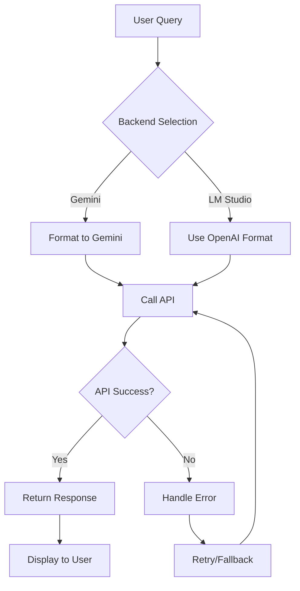

# Module llm — LLM Integration và Chat Interface

Phiên bản: chi tiết module LLM cho hệ thống RAG (Retrieval-Augmented Generation).

Mô tả ngắn: thư mục `llm/` chứa các thành phần xử lý tích hợp với Large Language Models (LLMs), bao gồm clients cho các API (Gemini, LM Studio), chat interface (Streamlit UI), và logic xử lý messages. Module này kết nối retrieval system với LLMs để tạo ra responses thông minh dựa trên context.

## Mục tiêu và phạm vi

- Tách trách nhiệm: xử lý giao tiếp với LLMs và UI chat
- Cung cấp multiple LLM backends (Gemini API, LM Studio local)
- Hỗ trợ RAG workflow với context retrieval
- Quản lý cấu hình và message formatting

## Kiến trúc tổng quan

Thư mục `llm/` gồm các phần chính:

- `LLM_FE.py` — Streamlit UI cho chat interface với RAG
- `LLM_API.py` — Client cho Google Gemini API
- `LLM_LOCAL.py` — Client cho LM Studio (local LLM)
- `chat_handler.py` — Logic xử lý messages và format prompts
- `config_loader.py` — Quản lý cấu hình từ YAML files
- `chat_styles.css` — CSS styling cho chat UI

Luồng dữ liệu điển hình:

```text
User Query → LLM_FE.py (Streamlit UI)
  → chat_handler.py (format messages)
  → retrieval system (get context)
  → LLM_API.py or LLM_LOCAL.py (call LLM)
  → format response → display to user
```

## Các module chính (chi tiết)

### LLM_FE.py

- Mục đích: giao diện Streamlit cho chatbot RAG
- Tính năng:
  - Chat interface với history
  - Backend selection (Gemini/LM Studio)
  - Integration với retrieval system
  - File upload và processing
  - Settings management

### LLM_API.py

- Mục đích: client cho Google Gemini API
- Tính năng:
  - Convert OpenAI format → Gemini format
  - Handle API calls với error handling
  - Streaming responses
  - Configuration management

### LLM_LOCAL.py

- Mục đích: client cho LM Studio (local LLM server)
- Tính năng:
  - OpenAI-compatible API calls
  - Local model management
  - Parameter tuning (temperature, top_p, max_tokens)

### chat_handler.py

- Mục đích: xử lý logic chat và message formatting
- Tính năng:
  - Load system prompts từ files
  - Format messages với context
  - Build conversation history
  - Template management

### config_loader.py

- Mục đích: centralized configuration management
- Tính năng:
  - Load YAML configs
  - Resolve API keys và endpoints
  - Path management
  - Environment variable handling

## Hành vi "Auto-quét" (Auto-scan) và tích hợp với pipeline

Module `llm/` tích hợp với pipeline thông qua:

- **Retrieval Integration**: `LLM_FE.py` gọi `pipeline.backend_connector.fetch_retrieval()`
- **Config Sharing**: Sử dụng chung `config/app.yaml`
- **Prompt Templates**: Load từ `prompts/rag_system_prompt.txt`

Ví dụ run chat interface:

```powershell
# Chạy Streamlit chat UI
streamlit run llm/LLM_FE.py
```

Hoặc sử dụng trực tiếp LLM clients:

```python
from llm.LLM_API import call_gemini
from llm.chat_handler import build_messages

# Build messages với context
messages = build_messages("user query", "retrieved context")

# Call Gemini
response = call_gemini(messages, temperature=0.7)
```

## Contract (tóm tắt API / dữ liệu)

- Input cho `call_gemini()`: messages (List[Dict]), parameters (temperature, etc.)
- Output: response string từ Gemini API
- Input cho `call_lmstudio()`: messages, model, temperature, top_p, max_tokens
- Output: response string từ LM Studio

## Edge cases và cách xử lý

- API key missing: config_loader raise exception
- Network errors: retry logic với exponential backoff
- Invalid responses: fallback handling
- Context too long: truncation logic

## Logging & Debugging

- LLM clients ghi log API calls và errors
- UI logs user interactions và retrieval calls
- Debug mode cho verbose output

## Kiểm thử

```powershell
# Test LLM clients
python -m pytest test/llm/ -v
```

## Hướng dẫn đóng góp (contributors)

- Viết comment và docstring bằng tiếng Việt
- Handle both direct execution và module import patterns
- Use config_loader thay vì hardcode configs
- Add proper error handling cho API calls

## Tài liệu tham chiếu và liên kết

- Pipeline: `pipeline/backend_connector.py` — retrieval integration
- Prompts: `prompts/rag_system_prompt.txt` — system prompts
- Config: `config/app.yaml` — LLM settings

## Ghi chú triển khai / Assumptions

- Gemini API key required trong environment
- LM Studio server phải chạy locally
- Streamlit version compatible với features used

## Chi tiết kỹ thuật theo file (tham chiếu mã nguồn)

### `llm/LLM_FE.py` — Streamlit Chat Interface

- Main function: `main()` — setup Streamlit UI
- Features:
  - `st.sidebar` — backend selection và settings
  - Chat history management
  - File upload processing
  - Real-time streaming responses

- Integration points:
  - `fetch_retrieval()` — get context từ pipeline
  - `call_gemini()` / `call_lmstudio()` — LLM calls
  - `build_messages()` — message formatting

### `llm/LLM_API.py` — Gemini Client

- Core function: `call_gemini(messages, **kwargs)`
- Format conversion: `convert_to_gemini_format()` — OpenAI → Gemini
- Error handling: try/catch với detailed logging

### `llm/LLM_LOCAL.py` — LM Studio Client

- Core function: `call_lmstudio(messages, model, **kwargs)`
- Client creation: `get_client()` — OpenAI client instance
- Direct OpenAI format support (no conversion needed)

### `llm/chat_handler.py` — Message Handler

- `load_system_prompt()` — load từ file
- `format_system_prompt(context)` — inject context
- `build_messages(user_query, context)` — create message list

### `llm/config_loader.py` — Configuration Manager

- `_load_yaml()` — YAML parsing
- `resolve_gemini_settings()` — Gemini API config
- `resolve_lmstudio_settings()` — LM Studio config
- `paths_*()` functions — path resolution

## Dữ liệu trả về (data shapes)

- `call_gemini()` return: `str` (response text)
- `call_lmstudio()` return: `str` (response text)
- `build_messages()` return: `List[Dict[str, str]]` (OpenAI format)
- `fetch_retrieval()` return: context string từ retrieval

## Ví dụ sử dụng chính xác theo code

Python (sử dụng LLM clients):

```python
from llm.LLM_API import call_gemini
from llm.LLM_LOCAL import call_lmstudio
from llm.chat_handler import build_messages

# Build messages với RAG context
messages = build_messages(
    user_query="What is RAG?",
    context="RAG stands for Retrieval-Augmented Generation..."
)

# Call Gemini
gemini_response = call_gemini(
    messages=messages,
    temperature=0.7,
    max_tokens=512
)

# Call LM Studio
lm_response = call_lmstudio(
    messages=messages,
    model="local-model-name",
    temperature=0.7,
    max_tokens=512
)
```

Streamlit UI:

```python
# Trong LLM_FE.py
if st.button("Send"):
    # Get retrieval context
    context = fetch_retrieval(user_query)

    # Build messages
    messages = build_messages(user_query, context)

    # Call selected backend
    if backend == "Gemini":
        response = call_gemini(messages)
    else:
        response = call_lmstudio(messages)

    st.write(response)
```

## Sơ đồ quyết định tích hợp — LLM Flow



ASCII fallback:

```text
LLM Flow:
1) User sends query
2) Select backend (Gemini/LM Studio)
3) Format messages appropriately
4) Call LLM API
5) Handle errors/retry if needed
6) Return formatted response
7) Display in UI
```

Hook points:

- Message preprocessing: `chat_handler.build_messages()`
- API error handling: retry logic in clients
- Response postprocessing: format cleaning
- UI customization: `chat_styles.css`

Testing hints:

- Mock LLM APIs for unit tests
- Test message formatting với various contexts
- Verify error handling với invalid API keys
- Test UI responsiveness với long responses
