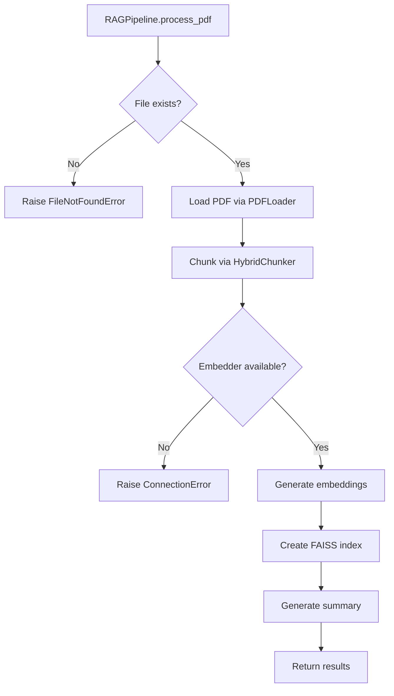

# Module pipeline — Điều phối RAG Pipeline

Phiên bản: chi tiết module pipeline cho hệ thống RAG (Retrieval-Augmented Generation).

Mô tả ngắn: thư mục `pipeline/` chứa các lớp và hàm chịu trách nhiệm điều phối toàn bộ quy trình RAG từ PDF thô đến vector storage và retrieval. Module này kết hợp loaders, chunkers, embedders để tạo ra một pipeline hoàn chỉnh có thể tìm kiếm và trả lời câu hỏi dựa trên tài liệu.

## Mục tiêu và phạm vi

- Tách trách nhiệm: điều phối các module con (loaders, chunkers, embedders) thành một workflow hoàn chỉnh.
- Cung cấp API rõ ràng để xử lý PDF hàng loạt và tìm kiếm vector similarity.
- Hỗ trợ caching, metadata management, và tích hợp BM25 (tùy chọn).

## Kiến trúc tổng quan

Thư mục `pipeline/` gồm các phần chính:

- `rag_pipeline.py` — Lớp chính điều phối toàn bộ pipeline từ PDF → Vector Storage.
- `vector_store.py` — Quản lý FAISS indexes và metadata persistence.
- `retriever.py` — Thực hiện similarity search trên FAISS indexes.
- `summary_generator.py` — Tạo tóm tắt tài liệu và báo cáo batch processing.
- `backend_connector.py` — Kết nối với backend services (nếu có).

Luồng dữ liệu điển hình:

```text
PDF files (data/pdf/*.pdf)
  -> RAGPipeline.process_pdf/process_directory
  -> PDFLoader → PDFDocument → HybridChunker → ChunkSet
  -> OllamaEmbedder → embeddings → VectorStore → FAISS index
  -> SummaryGenerator → metadata/summaries
  -> Retriever.search_similar → results
```

## Các module chính (chi tiết)

### rag_pipeline.py

- Mục đích: lớp orchestrator chính cho toàn bộ RAG pipeline.
- Tính năng thường thấy (factory + constructor injection):
  - `RAGPipeline()` — constructor với các tham số output_dir, pdf_dir, model_type.
  - `process_pdf(pdf_path)` — xử lý single PDF qua toàn bộ pipeline.
  - `process_directory(pdf_dir)` — xử lý tất cả PDFs trong thư mục.
  - `search_similar(faiss_file, metadata_map_file, query_text, top_k)` — tìm kiếm similarity.
  - `switch_model(model_type)` — chuyển đổi embedding model.

### vector_store.py

- Mục đích: quản lý FAISS vector indexes và metadata.
- Tính năng:
  - `VectorStore(vectors_dir)` — constructor.
  - `create_index(embeddings_data, file_name, timestamp)` — tạo FAISS index từ embeddings.
  - `load_index(faiss_file, metadata_map_file)` — tải index và metadata.

### retriever.py

- Mục đích: thực hiện similarity search trên FAISS indexes.
- Tính năng:
  - `Retriever(embedder)` — constructor.
  - `search_similar(faiss_file, metadata_map_file, query_text, top_k)` — tìm kiếm và trả về results với cosine similarity scores.

### summary_generator.py

- Mục đích: tạo tóm tắt tài liệu và báo cáo batch processing.
- Tính năng:
  - `SummaryGenerator(metadata_dir, output_dir)` — constructor.
  - `create_document_summary(pdf_doc, chunk_set, embeddings_data, faiss_file, metadata_map_file)` — tạo summary cho document.
  - `create_batch_summary(results)` — tạo báo cáo batch processing.

## Hành vi "Auto-quét" (Auto-scan) và tích hợp với pipeline

Thư mục `pipeline/` được thiết kế để chạy cả dưới dạng thư viện và trong một pipeline tự động.

- Auto-quét (ở cấp pipeline): file `run_pipeline.py` gọi `RAGPipeline.process_directory()` để quét `data/pdf/` và xử lý tất cả PDFs.
- Cơ chế cache: pipeline duy trì cache chunk đã xử lý trong `data/cache/processed_chunks.json`. Nếu nội dung chunk không đổi (dựa trên hash), pipeline sẽ bỏ qua re-processing.
- Để ép làm lại (force re-process), xóa file cache như hướng dẫn trong repository root.

Ví dụ run nhanh (PowerShell):

```powershell
# Chạy pipeline xử lý tất cả PDF trong data/pdf
python run_pipeline.py
```

Hoặc chỉ dùng pipeline trong script Python:

```python
from pipeline import RAGPipeline
from embedders.providers.ollama import OllamaModelType

# Tạo pipeline với Gemma embedder
pipeline = RAGPipeline(
    output_dir="data",
    model_type=OllamaModelType.GEMMA
)

# Xử lý một file PDF
result = pipeline.process_pdf("data/pdf/my_doc.pdf")
print(f"Processed {result['pages']} pages, {result['chunks']} chunks")

# Tìm kiếm
results = pipeline.search_similar(
    faiss_file=Path("data/vectors/my_doc_vectors.faiss"),
    metadata_map_file=Path("data/vectors/my_doc_metadata.pkl"),
    query_text="tìm kiếm nội dung",
    top_k=5
)
```

## Contract (tóm tắt API / dữ liệu)

- Input cho `process_pdf()`: đường dẫn file PDF (str hoặc Path).
- Output từ `process_pdf()`: dict với keys như 'success', 'file_name', 'pages', 'chunks', 'embeddings', 'files' (dict chứa paths).
- Input cho `search_similar()`: faiss_file (Path), metadata_map_file (Path), query_text (str), top_k (int).
- Output từ `search_similar()`: List[Dict] với cosine_similarity scores, text, metadata.

## Edge cases và cách xử lý

- File PDF rỗng: pipeline sẽ xử lý nhưng có thể tạo ra ít chunks/embeddings.
- Embedding model không khả dụng: pipeline sẽ raise ConnectionError khi test_connection() fail.
- FAISS index corrupted: retriever sẽ raise exception khi load_index().
- BM25 dependencies missing: pipeline sẽ log warning và tiếp tục without BM25.

## Logging & Debugging

- Pipeline ghi log chi tiết ở mức INFO/ERROR; tích hợp với logging config của toàn dự án.
- Để debug retrieval cụ thể, kiểm tra FAISS index files và metadata maps trong `data/vectors/`.

## Kiểm thử

- Repository có cấu hình pytest. Để chạy test liên quan tới pipeline:

```powershell
python -m pytest test/pipeline/ -v
```

## Hướng dẫn đóng góp (contributors)

- Viết comment và docstring bằng tiếng Việt theo convention của repo.
- Tuân theo pattern: composition over inheritance, single responsibility principle.
- Thêm unit test cho mọi thay đổi logic pipeline.
- Nếu thêm dependency, update `requirements.txt`.

## Tài liệu tham chiếu và liên kết

- Loaders: `loaders/pdf_loader.py` — cung cấp input cho pipeline.
- Chunkers: `chunkers/hybrid_chunker.py` — tạo chunks cho pipeline.
- Embedders: `embedders/` — tạo embeddings cho pipeline.
- Cấu hình toàn cục: `config/app.yaml`.

## Ghi chú triển khai / Assumptions

- README này mô tả API theo conventions được sử dụng trong repository. Nếu tên hàm khác, kiểm tra source code để đồng bộ.
- Ollama server phải chạy và có models embeddinggemma:latest và bge-m3:latest.

## Chi tiết kỹ thuật theo file (tham chiếu mã nguồn)

### `pipeline/rag_pipeline.py` — lớp RAGPipeline

- Lớp chính: `RAGPipeline`.
- Constructor (tham số chính):
  - `output_dir: str = "data"`
  - `pdf_dir: Optional[str | Path] = None`
  - `model_type: OllamaModelType = OllamaModelType.GEMMA`

- Methods chính:
  - `process_pdf(pdf_path, chunk_callback=None)` — xử lý single PDF, trả về dict results.
  - `process_directory(pdf_dir=None)` — xử lý tất cả PDFs trong thư mục.
  - `search_similar(faiss_file, metadata_map_file, query_text, top_k=10)` — tìm kiếm similarity.
  - `switch_model(model_type)` — chuyển đổi embedding model.
  - `get_info()` — trả về thông tin pipeline config.

- BM25 integration (tùy chọn):
  - `_setup_bm25_components()` — khởi tạo BM25 nếu dependencies available.
  - `search_bm25(query, top_k=5, normalize_scores=True)` — BM25 search.

### `pipeline/vector_store.py` — lớp VectorStore

- Lớp chính: `VectorStore`.
- Constructor: `VectorStore(vectors_dir: Path)`.

- Methods:
  - `create_index(embeddings_data, file_name, timestamp)` — tạo FAISS index với cosine similarity.
  - `load_index(faiss_file, metadata_map_file)` — tải index và metadata map.

### `pipeline/retriever.py` — lớp Retriever

- Lớp chính: `Retriever`.
- Constructor: `Retriever(embedder: IEmbedder)`.

- Methods:
  - `search_similar(faiss_file, metadata_map_file, query_text, top_k=10)` — tìm kiếm và trả về list results với scores.

### `pipeline/summary_generator.py` — lớp SummaryGenerator

- Lớp chính: `SummaryGenerator`.
- Constructor: `SummaryGenerator(metadata_dir: Path, output_dir: Path)`.

- Methods:
  - `create_document_summary(pdf_doc, chunk_set, embeddings_data, faiss_file, metadata_map_file)` — tạo summary dict.
  - `save_document_summary(summary, file_name, timestamp)` — lưu summary JSON.
  - `create_batch_summary(results)` — tạo batch report.
  - `save_batch_summary(batch_summary)` — lưu batch summary JSON.

## Dữ liệu trả về (data shapes)

- `process_pdf()` result dict:
  - `'success': bool`
  - `'file_name': str`
  - `'pages': int`
  - `'chunks': int`
  - `'embeddings': int`
  - `'skipped_chunks': int`
  - `'bm25_indexed': int`
  - `'files': dict` (chunks, embeddings, faiss_index, metadata_map, summary paths)

- `search_similar()` result list:
  - Mỗi item: `{'cosine_similarity': float, 'text': str, 'file_name': str, 'page_number': int, ...}`

## Ví dụ sử dụng chính xác theo code

Python (sử dụng trực tiếp):

```python
from pipeline import RAGPipeline
from embedders.providers.ollama import OllamaModelType

# Khởi tạo pipeline
pipeline = RAGPipeline(
    output_dir="data",
    model_type=OllamaModelType.GEMMA
)

# Xử lý directory
results = pipeline.process_directory("data/pdf")
print(f"Processed {len(results)} files")

# Tìm kiếm trên một file cụ thể
from pathlib import Path
faiss_file = Path("data/vectors/document_vectors.faiss")
metadata_file = Path("data/vectors/document_metadata.pkl")

if faiss_file.exists():
    results = pipeline.search_similar(
        faiss_file=faiss_file,
        metadata_map_file=metadata_file,
        query_text="câu hỏi của bạn",
        top_k=5
    )
    for result in results:
        print(f"Score: {result['cosine_similarity']:.4f}")
        print(f"Text: {result['text'][:100]}...")
```

PowerShell quick-run:

```powershell
python run_pipeline.py
```

## Sơ đồ quyết định tích hợp — Pipeline Flow



ASCII fallback:

```text
RAGPipeline.process_pdf(pdf_path):
1) Validate file exists
2) PDFLoader.load() -> PDFDocument
3) HybridChunker.chunk() -> ChunkSet
4) Test embedder connection
5) Generate embeddings for all chunks
6) VectorStore.create_index() -> FAISS + metadata
7) SummaryGenerator.create_document_summary()
8) Return result dict with file paths
```

Hook points:

- `chunk_callback` in `process_pdf()`: progress callback during embedding
- BM25 integration: automatic if dependencies available
- Model switching: `switch_model()` for runtime model changes

Testing hints:

- Mock Ollama embedder for unit tests
- Test with small PDF files for integration tests
- Verify FAISS index creation and search accuracy
