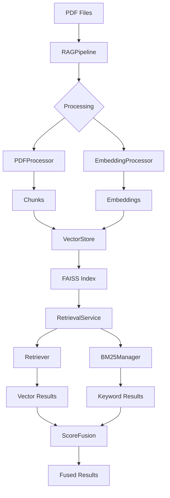

# Pipeline Module — RAG Pipeline Orchestration

Version: Modular RAG pipeline with processing, storage, and retrieval submodules.

**Short description**: The `pipeline/` directory orchestrates the complete RAG workflow from PDF processing to vector storage and retrieval. It coordinates loaders, chunkers, embedders, and search components into a cohesive pipeline for document processing and question answering.

## Objectives and Scope

- **Single Responsibility**: Orchestrate PDF → chunks → embeddings → vector storage → retrieval
- **Modular Design**: Organized into processing, storage, and retrieval submodules
- **Multiple Embedders**: Support Ollama and HuggingFace embedding providers
- **Hybrid Search**: Vector similarity + BM25 keyword search integration
- **Batch Processing**: Directory-level PDF processing with progress tracking

## High-Level Architecture

The `pipeline/` module is organized into specialized submodules:

- **`rag_pipeline.py`** — Main orchestrator coordinating the full workflow
- **`backend_connector.py`** — Legacy compatibility and external service integration
- **`processing/`** — PDF and embedding processing components
  - `pdf_processor.py` — PDF loading and chunking coordination
  - `embedding_processor.py` — Batch embedding generation
- **`storage/`** — File I/O and data persistence
  - `file_manager.py` — File operations and batch management
  - `vector_store.py` — FAISS index management
  - `summary_generator.py` — Document summaries and reports
- **`retrieval/`** — Search and retrieval operations
  - `retrieval_service.py` — Hybrid search coordination
  - `retrieval_orchestrator.py` — Query processing and result fusion
  - `retriever.py` — Vector similarity search
  - `score_fusion.py` — Score normalization and merging

**Data Flow**:
```
PDF Files → PDFProcessor → Chunks → EmbeddingProcessor → Vectors
  ↓
VectorStore (FAISS) + BM25Manager → RetrievalService → Results
```

## Key Components (Detailed)

### `RAGPipeline` (`rag_pipeline.py`)

Main orchestrator for the complete RAG workflow:

- **`process_pdf()`** — Process single PDF through full pipeline
- **`process_directory()`** — Batch process all PDFs in directory
- **Multi-embedder support** — Ollama (Gemma/BGE-M3) and HuggingFace
- **Caching** — Skip reprocessing of unchanged chunks
- **Progress callbacks** — Real-time processing updates

### Processing Submodule

#### `PDFProcessor` (`processing/pdf_processor.py`)
- **Factory function**: `create_pdf_processor()` for easy instantiation
- **Coordinates**: PDF loading + semantic chunking
- **Multi-language support**: Auto-detects language for chunking
- **Content aggregation**: Combines text, tables, and figures

#### `EmbeddingProcessor` (`processing/embedding_processor.py`)
- **Batch processing**: Efficient embedding generation for chunk sets
- **Provider abstraction**: Works with any embedder implementing `IEmbedder`
- **Progress tracking**: Callbacks for long-running operations
- **Error handling**: Graceful failure recovery

### Storage Submodule

#### `VectorStore` (`storage/vector_store.py`)
- **FAISS integration**: Create and load vector indexes
- **Metadata management**: Store chunk provenance and metadata
- **Cosine similarity**: Optimized for semantic search
- **Persistence**: Save/load indexes to disk

#### `FileManager` (`storage/file_manager.py`)
- **File operations**: Centralized I/O for chunks, embeddings, vectors
- **Batch management**: `BatchSummaryManager` for processing reports
- **Path resolution**: Consistent file naming and organization
- **Cache management**: Processed chunks tracking

#### `SummaryGenerator` (`storage/summary_generator.py`)
- **Document summaries**: Generate comprehensive PDF reports
- **Batch reports**: Aggregate processing statistics
- **JSON output**: Structured metadata for downstream use
- **Timestamp tracking**: Processing history and versioning

### Retrieval Submodule

#### `RetrievalService` (`retrieval/retrieval_service.py`)
- **Hybrid search**: Coordinate vector + BM25 retrieval
- **Query processing**: Handle user queries and context
- **Result fusion**: Merge and rank search results

#### `RetrievalOrchestrator` (`retrieval/retrieval_orchestrator.py`)
- **Query enhancement**: Integrate with QEM (Query Enhancement Module)
- **Multi-stage retrieval**: Vector search → reranking → final results
- **Provider abstraction**: Support multiple retrieval strategies

#### `Retriever` (`retrieval/retriever.py`)
- **Vector search**: FAISS-based similarity search
- **Top-k retrieval**: Configurable result limits
- **Score filtering**: Threshold-based result filtering

#### `ScoreFusion` (`retrieval/score_fusion.py`)
- **Score normalization**: Z-score normalization across providers
- **Result merging**: Combine vector and BM25 results
- **Ranking**: Final result ordering by relevance

## Usage Examples

### Basic Pipeline Usage

```python
from pipeline.rag_pipeline import RAGPipeline
from embedders.embedder_type import EmbedderType
from embedders.providers.ollama import OllamaModelType

# Initialize pipeline with Ollama Gemma embedder
pipeline = RAGPipeline(
    output_dir="data",
    embedder_type=EmbedderType.OLLAMA,
    model_type=OllamaModelType.GEMMA
)

# Process single PDF
result = pipeline.process_pdf("data/pdf/document.pdf")
print(f"Processed {result['chunks']} chunks, {result['embeddings']} embeddings")

# Process directory
results = pipeline.process_directory("data/pdf")
print(f"Processed {len(results)} documents")
```

### HuggingFace Embedder

```python
# Initialize with HuggingFace API embedder
pipeline = RAGPipeline(
    output_dir="data",
    embedder_type=EmbedderType.HUGGINGFACE,
    hf_model_name="intfloat/multilingual-e5-large",
    hf_use_api=True,
    hf_api_token="your-hf-token"
)
```

### Retrieval Operations

```python
from pipeline.retrieval.retrieval_service import RetrievalService

# Initialize retrieval service
retrieval = RetrievalService(
    vectors_dir="data/vectors",
    bm25_manager=BM25Manager("data/bm25_index")
)

# Hybrid search
results = retrieval.retrieve_hybrid(
    query="machine learning algorithms",
    top_k=10
)

for result in results:
    print(f"Score: {result['score']:.4f}")
    print(f"Text: {result['text'][:100]}...")
```

## API Contracts

### `RAGPipeline.process_pdf()`
- **Input**: `pdf_path` (str/Path), `chunk_callback` (optional progress function)
- **Output**: `Dict` with processing statistics and file paths
- **Keys**: `success`, `file_name`, `pages`, `chunks`, `embeddings`, `files`

### `RAGPipeline.process_directory()`
- **Input**: `pdf_dir` (optional str/Path, defaults to pipeline's pdf_dir)
- **Output**: `List[Dict]` - Results for each processed PDF

### `RetrievalService.retrieve_hybrid()`
- **Input**: `query` (str), `top_k` (int), `**kwargs`
- **Output**: `List[Dict]` with `score`, `text`, `metadata`, `provenance`

## Mermaid: Pipeline Architecture



ASCII fallback:
```
Pipeline Flow:
1) PDF files → RAGPipeline
2) PDFProcessor → Chunks
3) EmbeddingProcessor → Embeddings
4) VectorStore → FAISS index
5) RetrievalService coordinates search
6) Retriever + BM25Manager → Results
7) ScoreFusion → Final ranked results
```

### Embedder Configuration
- **Ollama**: Requires running Ollama server (localhost:11434)
- **HuggingFace API**: Needs API token, subject to rate limits
- **HuggingFace Local**: Downloads models, requires transformers/torch

### Performance Considerations
- **Batch processing**: Use `process_directory()` for multiple PDFs
- **Caching**: Pipeline skips unchanged chunks automatically
- **Memory usage**: Large PDFs may require significant RAM for embeddings

## Architecture Patterns

**Modular Organization**:
- **Processing**: Input transformation (PDF → chunks → embeddings)
- **Storage**: Data persistence and file management
- **Retrieval**: Search operations and result fusion

**Dependency Injection**:
- Components receive dependencies via constructor
- Factory functions for complex object creation
- Configuration-driven initialization

**Error Handling**:
- Graceful degradation (BM25 optional)
- Detailed logging for debugging
- Exception propagation with context

## Contribution Guidelines

- **Single Responsibility**: Each module has one clear purpose
- **Factory Pattern**: Use factories for complex object creation
- **Testing**: Unit tests for all new functionality
- **Documentation**: Update READMEs when adding features
- **Type Hints**: Use proper type annotations

## Reference Links

- **PDFLoaders**: `PDFLoaders/` - PDF processing components
- **Chunkers**: `chunkers/` - Text segmentation
- **Embedders**: `embedders/` - Embedding generation
- **BM25**: `BM25/` - Keyword search integration
- **Configuration**: `config/app.yaml` - Pipeline settings
  - `create_index(embeddings_data, file_name, timestamp)` — tạo FAISS index từ embeddings.
  - `load_index(faiss_file, metadata_map_file)` — tải index và metadata.

### retriever.py

- Mục đích: thực hiện similarity search trên FAISS indexes.
- Tính năng:
  - `Retriever(embedder)` — constructor.
  - `search_similar(faiss_file, metadata_map_file, query_text, top_k)` — tìm kiếm và trả về results với cosine similarity scores.

### summary_generator.py

- Mục đích: tạo tóm tắt tài liệu và báo cáo batch processing.
- Tính năng:
  - `SummaryGenerator(metadata_dir, output_dir)` — constructor.
  - `create_document_summary(pdf_doc, chunk_set, embeddings_data, faiss_file, metadata_map_file)` — tạo summary cho document.
  - `create_batch_summary(results)` — tạo báo cáo batch processing.

## Hành vi "Auto-quét" (Auto-scan) và tích hợp với pipeline

Thư mục `pipeline/` được thiết kế để chạy cả dưới dạng thư viện và trong một pipeline tự động.

- Auto-quét (ở cấp pipeline): file `run_pipeline.py` gọi `RAGPipeline.process_directory()` để quét `data/pdf/` và xử lý tất cả PDFs.
- Cơ chế cache: pipeline duy trì cache chunk đã xử lý trong `data/cache/processed_chunks.json`. Nếu nội dung chunk không đổi (dựa trên hash), pipeline sẽ bỏ qua re-processing.
- Để ép làm lại (force re-process), xóa file cache như hướng dẫn trong repository root.

Ví dụ run nhanh (PowerShell):

```powershell
# Chạy pipeline xử lý tất cả PDF trong data/pdf
python run_pipeline.py
```

Hoặc chỉ dùng pipeline trong script Python:

```python
from pipeline import RAGPipeline
from embedders.providers.ollama import OllamaModelType

# Tạo pipeline với Gemma embedder
pipeline = RAGPipeline(
    output_dir="data",
    model_type=OllamaModelType.GEMMA
)

# Xử lý một file PDF
result = pipeline.process_pdf("data/pdf/my_doc.pdf")
print(f"Processed {result['pages']} pages, {result['chunks']} chunks")

# Tìm kiếm
results = pipeline.search_similar(
    faiss_file=Path("data/vectors/my_doc_vectors.faiss"),
    metadata_map_file=Path("data/vectors/my_doc_metadata.pkl"),
    query_text="tìm kiếm nội dung",
    top_k=5
)
```

## Contract (tóm tắt API / dữ liệu)

- Input cho `process_pdf()`: đường dẫn file PDF (str hoặc Path).
- Output từ `process_pdf()`: dict với keys như 'success', 'file_name', 'pages', 'chunks', 'embeddings', 'files' (dict chứa paths).
- Input cho `search_similar()`: faiss_file (Path), metadata_map_file (Path), query_text (str), top_k (int).
- Output từ `search_similar()`: List[Dict] với cosine_similarity scores, text, metadata.

## Edge cases và cách xử lý

- File PDF rỗng: pipeline sẽ xử lý nhưng có thể tạo ra ít chunks/embeddings.
- Embedding model không khả dụng: pipeline sẽ raise ConnectionError khi test_connection() fail.
- FAISS index corrupted: retriever sẽ raise exception khi load_index().
- BM25 dependencies missing: pipeline sẽ log warning và tiếp tục without BM25.

## Logging & Debugging

- Pipeline ghi log chi tiết ở mức INFO/ERROR; tích hợp với logging config của toàn dự án.
- Để debug retrieval cụ thể, kiểm tra FAISS index files và metadata maps trong `data/vectors/`.

## Kiểm thử

- Repository có cấu hình pytest. Để chạy test liên quan tới pipeline:

```powershell
python -m pytest test/pipeline/ -v
```

## Hướng dẫn đóng góp (contributors)

- Viết comment và docstring bằng tiếng Việt theo convention của repo.
- Tuân theo pattern: composition over inheritance, single responsibility principle.
- Thêm unit test cho mọi thay đổi logic pipeline.
- Nếu thêm dependency, update `requirements.txt`.

## Tài liệu tham chiếu và liên kết

- Loaders: `loaders/pdf_loader.py` — cung cấp input cho pipeline.
- Chunkers: `chunkers/hybrid_chunker.py` — tạo chunks cho pipeline.
- Embedders: `embedders/` — tạo embeddings cho pipeline.
- Cấu hình toàn cục: `config/app.yaml`.

## Ghi chú triển khai / Assumptions

- README này mô tả API theo conventions được sử dụng trong repository. Nếu tên hàm khác, kiểm tra source code để đồng bộ.
- Ollama server phải chạy và có models embeddinggemma:latest và bge-m3:latest.

## Chi tiết kỹ thuật theo file (tham chiếu mã nguồn)

### `pipeline/rag_pipeline.py` — lớp RAGPipeline

- Lớp chính: `RAGPipeline`.
- Constructor (tham số chính):
  - `output_dir: str = "data"`
  - `pdf_dir: Optional[str | Path] = None`
  - `model_type: OllamaModelType = OllamaModelType.GEMMA`

- Methods chính:
  - `process_pdf(pdf_path, chunk_callback=None)` — xử lý single PDF, trả về dict results.
  - `process_directory(pdf_dir=None)` — xử lý tất cả PDFs trong thư mục.
  - `search_similar(faiss_file, metadata_map_file, query_text, top_k=10)` — tìm kiếm similarity.
  - `switch_model(model_type)` — chuyển đổi embedding model.
  - `get_info()` — trả về thông tin pipeline config.

- BM25 integration (tùy chọn):
  - `_setup_bm25_components()` — khởi tạo BM25 nếu dependencies available.
  - `search_bm25(query, top_k=5, normalize_scores=True)` — BM25 search.

### `pipeline/vector_store.py` — lớp VectorStore

- Lớp chính: `VectorStore`.
- Constructor: `VectorStore(vectors_dir: Path)`.

- Methods:
  - `create_index(embeddings_data, file_name, timestamp)` — tạo FAISS index với cosine similarity.
  - `load_index(faiss_file, metadata_map_file)` — tải index và metadata map.

### `pipeline/retriever.py` — lớp Retriever

- Lớp chính: `Retriever`.
- Constructor: `Retriever(embedder: IEmbedder)`.

- Methods:
  - `search_similar(faiss_file, metadata_map_file, query_text, top_k=10)` — tìm kiếm và trả về list results với scores.

### `pipeline/summary_generator.py` — lớp SummaryGenerator

- Lớp chính: `SummaryGenerator`.
- Constructor: `SummaryGenerator(metadata_dir: Path, output_dir: Path)`.

- Methods:
  - `create_document_summary(pdf_doc, chunk_set, embeddings_data, faiss_file, metadata_map_file)` — tạo summary dict.
  - `save_document_summary(summary, file_name, timestamp)` — lưu summary JSON.
  - `create_batch_summary(results)` — tạo batch report.
  - `save_batch_summary(batch_summary)` — lưu batch summary JSON.

## Dữ liệu trả về (data shapes)

- `process_pdf()` result dict:
  - `'success': bool`
  - `'file_name': str`
  - `'pages': int`
  - `'chunks': int`
  - `'embeddings': int`
  - `'skipped_chunks': int`
  - `'bm25_indexed': int`
  - `'files': dict` (chunks, embeddings, faiss_index, metadata_map, summary paths)

- `search_similar()` result list:
  - Mỗi item: `{'cosine_similarity': float, 'text': str, 'file_name': str, 'page_number': int, ...}`

## Ví dụ sử dụng chính xác theo code

Python (sử dụng trực tiếp):

```python
from pipeline import RAGPipeline
from embedders.providers.ollama import OllamaModelType

# Khởi tạo pipeline
pipeline = RAGPipeline(
    output_dir="data",
    model_type=OllamaModelType.GEMMA
)

# Xử lý directory
results = pipeline.process_directory("data/pdf")
print(f"Processed {len(results)} files")

# Tìm kiếm trên một file cụ thể
from pathlib import Path
faiss_file = Path("data/vectors/document_vectors.faiss")
metadata_file = Path("data/vectors/document_metadata.pkl")

if faiss_file.exists():
    results = pipeline.search_similar(
        faiss_file=faiss_file,
        metadata_map_file=metadata_file,
        query_text="câu hỏi của bạn",
        top_k=5
    )
    for result in results:
        print(f"Score: {result['cosine_similarity']:.4f}")
        print(f"Text: {result['text'][:100]}...")
## Reference Links

- **PDFLoaders**: `PDFLoaders/` - PDF processing components
- **Chunkers**: `chunkers/` - Text segmentation
- **Embedders**: `embedders/` - Embedding generation
- **BM25**: `BM25/` - Keyword search integration
- **Configuration**: `config/app.yaml` - Pipeline settings
