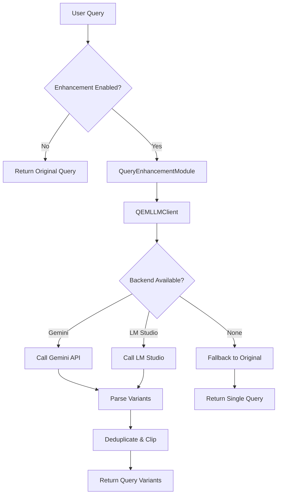

# Query Enhancement Module — Query Expansion for RAG

Version: LLM-powered query enhancement with multi-language support and embedding fusion.

**Short description**: The `query_enhancement/` directory contains components for expanding user queries into multiple variants using LLMs. This improves retrieval recall by generating semantically equivalent queries in different languages and formulations, then fusing their embeddings for hybrid search.

## Objectives and Scope

- **Single Responsibility**: Query expansion and embedding fusion only
- **Multi-language Support**: Generate variants in Vietnamese, English, and other languages
- **LLM Integration**: Use Gemini or LM Studio for intelligent query expansion
- **Embedding Fusion**: Combine multiple query embeddings for better retrieval
- **Fallback Handling**: Graceful degradation when LLM services are unavailable

## High-Level Architecture

The `query_enhancement/` module consists of:

- **`query_processor.py`** — Main coordinator for query enhancement and embedding fusion
- **`qem_core.py`** — QueryEnhancementModule orchestrator with configuration management
- **`qem_lm_client.py`** — LLM client wrapper for Gemini/LM Studio backends
- **`qem_strategy.py`** — Prompt engineering and template management
- **`qem_utils.py`** — Utility functions for parsing, deduplication, and logging
- **`qem_config.yaml`** — Default configuration settings

**Data Flow**:
```
User Query → QueryProcessor → QEM Core → LLM Client → Query Variants
  ↓
Embedding Fusion → Multiple Embeddings → Retrieval System
```

## Key Components (Detailed)

### `QueryProcessor` (`query_processor.py`)

Main coordinator for the query enhancement workflow:

- **`enhance_query()`** — Generate query variants using QEM
- **`fuse_query_embeddings()`** — Combine embeddings from multiple query variants
- **Integration layer** — Connects QEM with embedding generation
- **Configuration handling** — Enable/disable enhancement features

### `QueryEnhancementModule` (`qem_core.py`)

Core orchestrator for query expansion:

- **`enhance()`** — Main method to expand queries using LLM
- **Configuration management** — Load settings from YAML with defaults
- **Backend resolution** — Auto-select available LLM (Gemini → LM Studio fallback)
- **Error handling** — Fallback to original query on failures

### `QEMLLMClient` (`qem_lm_client.py`)

LLM client abstraction for multiple backends:

- **`generate_variants()`** — Call LLM to generate query variants
- **Backend switching** — Gemini or LM Studio based on availability
- **Format handling** — Convert between different LLM APIs
- **Retry logic** — Handle transient API failures

### `QEMStrategy` (`qem_strategy.py`)

Prompt engineering and template management:

- **`build_prompt()`** — Construct prompts for LLM query expansion
- **Language specification** — Generate variants in multiple languages
- **Instruction tuning** — Optimize prompts for better results
- **Template management** — Reusable prompt components

### `QEMUtils` (`qem_utils.py`)

Utility functions for query processing:

- **`parse_llm_list()`** — Parse LLM output into structured query lists
- **`deduplicate_queries()`** — Remove duplicate variants
- **`log_activity()`** — JSONL logging for debugging and analytics
- **`clip_queries()`** — Limit number of variants to prevent over-expansion

## Usage Examples

### Basic Query Enhancement

```python
from query_enhancement.query_processor import QueryProcessor
from query_enhancement.qem_core import QueryEnhancementModule

# Initialize QEM
qem = QueryEnhancementModule(app_config={"llm": {"backend": "gemini"}})

# Create processor
processor = QueryProcessor(qem_module=qem)

# Enhance query
variants = processor.enhance_query("machine learning algorithms")
print(variants)
# Output: ['machine learning algorithms', 'thuật toán máy học', 'ML algorithms', 'artificial intelligence methods']
```

### Embedding Fusion

```python
from embedders.embedder_factory import EmbedderFactory

# Initialize embedder
embedder = EmbedderFactory.create_gemma()
processor = QueryProcessor(qem_module=qem, embedder=embedder)

# Generate fused embeddings
query_embeddings = processor.fuse_query_embeddings("AI research")
print(f"Fused {len(query_embeddings)} embeddings")
```

### Configuration

```python
# Custom QEM settings
qem_settings = {
    "enabled": True,
    "languages": {"vi": 2, "en": 2},  # 2 variants each language
    "max_total_queries": 5,
    "backend": "gemini"
}

qem = QueryEnhancementModule(
    app_config={},
    qem_settings=qem_settings
)
```

## API Contracts

### `QueryProcessor.enhance_query()`
- **Input**: `query_text` (str), `use_enhancement` (bool, default=True)
- **Output**: `List[str]` - Query variants including original
- **Guarantees**: Always returns at least the original query

### `QueryProcessor.fuse_query_embeddings()`
- **Input**: `query_text` (str), `use_enhancement` (bool, default=True)
- **Output**: `List[np.ndarray]` - List of embedding vectors
- **Requires**: Embedder instance to be set

### `QueryEnhancementModule.enhance()`
- **Input**: `user_query` (str)
- **Output**: `List[str]` - Enhanced query variants
- **Fallback**: Returns `[user_query]` if enhancement fails

## Mermaid: Query Enhancement Flow



ASCII fallback:
```
Query Enhancement Flow:
1) Check if enhancement enabled
2) If disabled → return original query
3) If enabled → call QEM module
4) Select available LLM backend
5) Generate variants via LLM
6) Parse and clean results
7) Return enhanced queries
```

## Testing & Validation

### Unit Tests
```python
# Test QEM core functionality
qem = QueryEnhancementModule(app_config={})
variants = qem.enhance("test query")
assert len(variants) >= 1
assert "test query" in variants

# Test query processor
processor = QueryProcessor(qem_module=qem)
enhanced = processor.enhance_query("test")
assert isinstance(enhanced, list)
```

### Integration Tests
```python
# Test with real LLM (requires API keys)
qem = QueryEnhancementModule(app_config={"llm": {"backend": "gemini"}})
variants = qem.enhance("machine learning")
assert len(variants) > 1  # Should generate multiple variants
```

## Operational Notes

### LLM Backend Selection
- **Primary**: Gemini API (faster, more reliable)
- **Fallback**: LM Studio (local, no API costs)
- **Auto-detection**: Tests availability and switches automatically

### Language Support
- **Vietnamese**: Native language variants
- **English**: Technical and colloquial forms
- **Configurable**: Add more languages via `qem_config.yaml`

### Performance Considerations
- **Latency**: LLM calls add ~2-5 seconds per query
- **Caching**: Consider caching frequent query expansions
- **Batch processing**: Process multiple queries together when possible

## Configuration

### `qem_config.yaml`
```yaml
enabled: true
languages:
  vi: 2    # 2 Vietnamese variants
  en: 2    # 2 English variants
max_total_queries: 5
backend: gemini
llm_overrides:
  temperature: 0.7
  max_tokens: 256
```

### Environment Variables
- `GEMINI_API_KEY`: Required for Gemini backend
- `QEM_ENABLED`: Override enabled flag
- `QEM_BACKEND`: Force specific backend

## Architecture Pattern

**Strategy Pattern**:
- `QEMStrategy` encapsulates prompt generation logic
- Easy to extend with new prompt strategies
- Separates prompt engineering from LLM calling

**Adapter Pattern**:
- `QEMLLMClient` adapts different LLM APIs to common interface
- Backend switching without changing client code
- Consistent error handling across providers

**Template Method Pattern**:
- `QueryEnhancementModule` defines enhancement workflow
- Subclasses can override specific steps
- Maintains consistent overall process

## Migration Notes

### From Legacy Code
- Old function-based approach → New OOP design
- Manual LLM calls → Abstracted client layer
- Hardcoded prompts → Configurable strategy pattern

### Backward Compatibility
- Maintains same public API where possible
- Configuration loading is backward compatible
- Graceful fallback for missing configurations

## Contribution Guidelines

- **OOP Principles**: Use inheritance and polymorphism appropriately
- **Configuration**: Add new settings to `qem_config.yaml`
- **Testing**: Mock LLM calls for unit tests
- **Documentation**: Update examples when adding features
- **Error Handling**: Always provide fallback behavior

## Reference Links

- **LLM Integration**: `llm/` - LLM client implementations
- **Pipeline Integration**: `pipeline/retrieval/` - How QEM is used in retrieval
- **Configuration**: `config/app.yaml` - Global settings
- **Embedding Fusion**: `query_processor.py` - Multi-query embedding logic
  - `_call_gemini()` / `_call_lmstudio()` — Call respective LLM services
  - Fallback mechanism when primary backend fails

### qem_strategy.py

- **Purpose**: Build standardized prompts for LLM
- **Features**:
  - `build_prompt()` — Create prompts with language, format, and instructions

### qem_utils.py

- **Purpose**: Utility functions for QEM
- **Features**:
  - `parse_llm_list()` — Parse LLM output into list
  - `deduplicate_queries()` — Remove duplicates
  - `log_activity()` — Write JSONL logs
  - `clip_queries()` — Limit query count

### qem_config.yaml

- **Purpose**: Default configuration for QEM
- **Main settings**: enabled, languages, max_total_queries, backend, llm_overrides

## Auto-Scan Behavior and Pipeline Integration

The `query_enhancement/` module integrates with the main RAG pipeline:

- **Automatic Enhancement**: Pipeline automatically calls QueryEnhancementModule for search queries
- **Multi-query Retrieval**: Expand single query into multiple variants to improve recall
- **Fallback Option**: Return original query if LLM enhancement fails
- **Logging**: Record all enhancement activities in JSONL logs

Example usage in backend_connector:

```python
from query_enhancement import QueryEnhancementModule

# Initialize QEM
qem = QueryEnhancementModule(app_config)

# Expand query
enhanced_queries = qem.enhance("search for AI information")
# Result: ["search for AI information", "tìm kiếm thông tin về AI", "find AI info", "artificial intelligence search"]
```

## 🔌 API Contract

### Inputs/Outputs
- **Input** for `QueryEnhancementModule.enhance()`: user_query (str)
- **Output**: List[str] containing original query + variants (always at least 1 query)
- **Input** for `load_qem_settings()`: base_dir (Optional[Path])
- **Output**: Dict of merged QEM configuration with defaults

## ⚠️ Operational Notes

### Edge Cases
- LLM API failure: Fallback to original query with warning log
- Missing config file: Use DEFAULT_SETTINGS
- Empty query: Return original query
- Duplicate variants: Automatic deduplication
- Too many variants: Clip to max_total_queries limit

## 💡 Usage Examples

```python
from query_enhancement import QueryEnhancementModule

# Initialize with default config
qem = QueryEnhancementModule(app_config={})

# Expand simple query
queries = qem.enhance("machine learning")
print(queries)
# Output: ['machine learning', 'máy học', 'ML algorithms', 'artificial intelligence']

# With custom configuration
custom_settings = {
    "enabled": True,
    "languages": {"vi": 1, "en": 1},
    "max_total_queries": 3,
    "backend": "gemini"
}
qem_custom = QueryEnhancementModule(app_config={}, qem_settings=custom_settings)
```

## 🧪 Testing & Validation

### Unit Tests
Run query_enhancement related tests:

```powershell
python -m pytest tests/query_enhancement/ -v
```

## 🤝 Contributing

### Guidelines
- Write comments and docstrings in Vietnamese following repo conventions
- Follow single responsibility principle
- Add unit tests for all logic enhancement changes
- Update QEMLLMClient and qem_config.yaml when adding new LLM backends

## 📚 Technical Reference

### Integration Points
- **LLM Integration**: `llm/LLM_API.py`, `llm/LLM_LOCAL.py` — LLM backend providers
- **Backend Connector**: `pipeline/backend_connector.py` — QEM usage in retrieval
- **Global Configuration**: `config/app.yaml`

### Implementation Notes
- README describes API following repository conventions
- Gemini/LM Studio APIs must be properly configured in app_config
- QEM operates asynchronously without blocking retrieval pipeline

### Key Implementation Files
- `pipeline/query_enhancement/qem_core.py` — QueryEnhancementModule class
- Constructor parameters: app_config, qem_settings, logger

## Reference Links

- **LLM Integration**: `llm/` - LLM client implementations
- **Pipeline Integration**: `pipeline/retrieval/` - How QEM is used in retrieval
- **Configuration**: `config/app.yaml` - Global settings
- **Embedding Fusion**: `query_processor.py` - Multi-query embedding logic